# Customer Shopping Data Analysis

## Project Overview

---

This project analyzes retail shopping transactions across multiple shopping malls using SQL and Tableau.

---

The project includes:

### Data Quality & Preparation
Data validation, cleaning, and standardization.

### Business Analysis
Revenue, customer, product, mall, and time-series analysis.

### Customer Churn Forecasting
Recency-based customer segmentation and churn risk forecasting.

---

## Customer shopping data

- File Name: `customer_shopping_data.csv`
- File Size: 7.5 MB
- Total Records: 99457

---
# Tools Used

- SQL (MySQL)
- Tableau Public
- CSV files

---

# Data Quality & Data Preparation

## Data Quality Checks

The dataset was checked for data integrity issues that could affect analysis.

The following checks were performed:
- null values across all columns
- duplicate records (full row and invoice-level)
- empty strings in text fields
- leading and trailing spaces
- hidden or control characters
- data type consistency
- invalid values in numeric fields (price, quantity, age)
- date format consistency and parsing issues

No critical data quality issues were identified.

---

## Data Preparation

The dataset was standardized for analytical use.

The following transformations were applied:
- trimming of text fields
- conversion of numeric fields to proper data types
- conversion of invoice_date to date format
- standardization of values for grouping and aggregation

A cleaned dataset was created and used for analysis.

---

## Exploratory Data Analysis (EDA)

The dataset was analyzed to understand business performance across sales, products, customers, and time.

The analysis covered:

### Revenue
- total revenue
- revenue trends over time (monthly, yearly)
- revenue by shopping mall
- revenue by product category
- revenue by payment method

### Transactions
- total number of transactions
- transaction trends over time
- distribution of transaction values

### Products
- top categories by revenue and quantity
- category performance comparison

### Customers
- revenue by gender
- age-based spending behavior
- category preferences by customer segments
---
### For instance, 
```sql
select
    gender,
    case
        when age between 18 and 25 then '18-25'
        when age between 26 and 35 then '26-35'
        when age between 36 and 45 then '36-45'
        when age between 46 and 60 then '46-60'
        else '60+'
        end as age_group,
    category,
    count(*) as total_purchases_by_age_group
from customer_shopping_data_cleaned
group by
    gender,
    age_group,
    category
order by
    gender,
    age_group,
    total_purchases_by_age_group desc; 
    
```
---

# Tableau Visualizations

---

## Monthly Revenue Trend, 2021

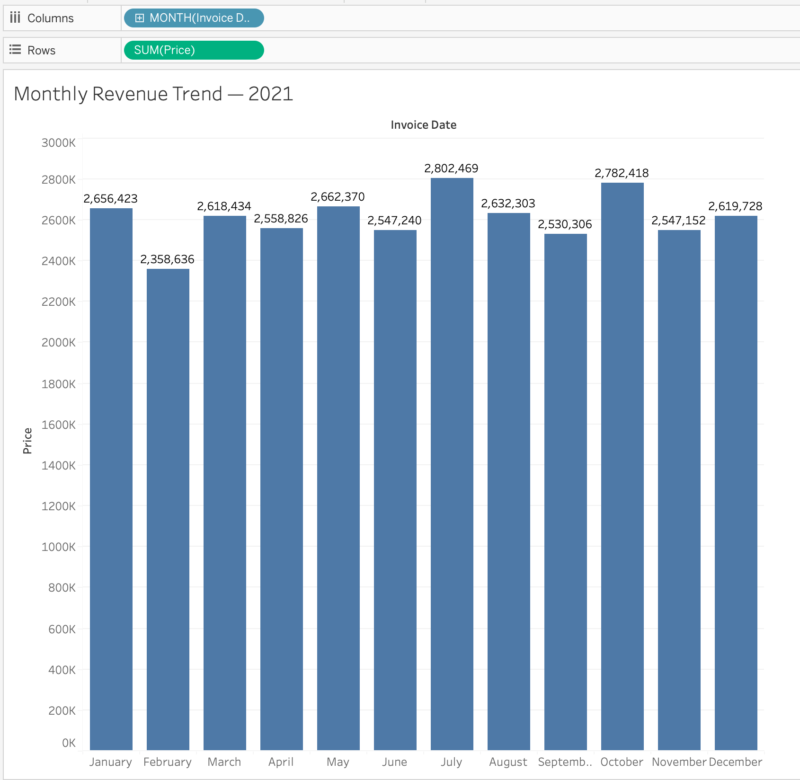

---

## Monthly Revenue Trend, 2022

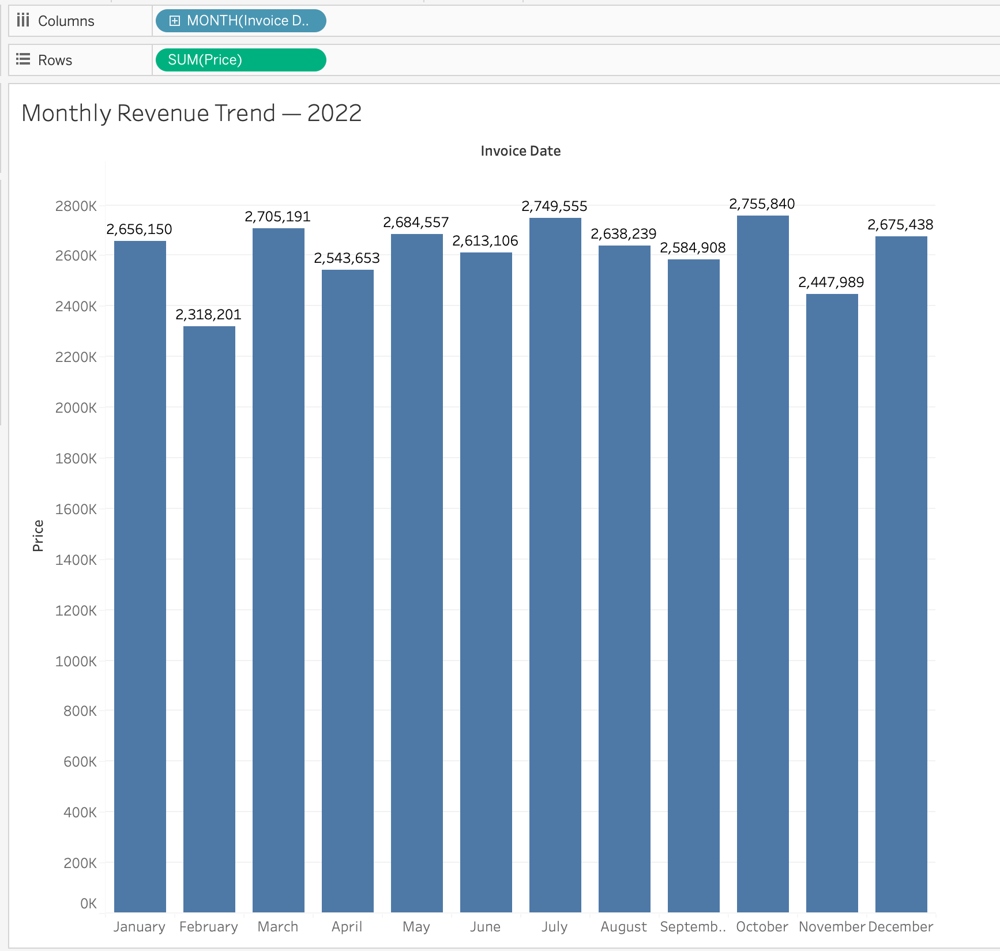

---

## Revenue by Product Category, 2021

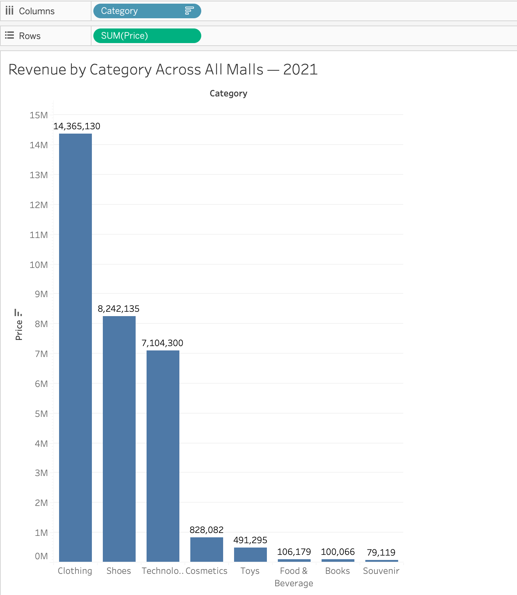

---

## Revenue by Product Category, 2022

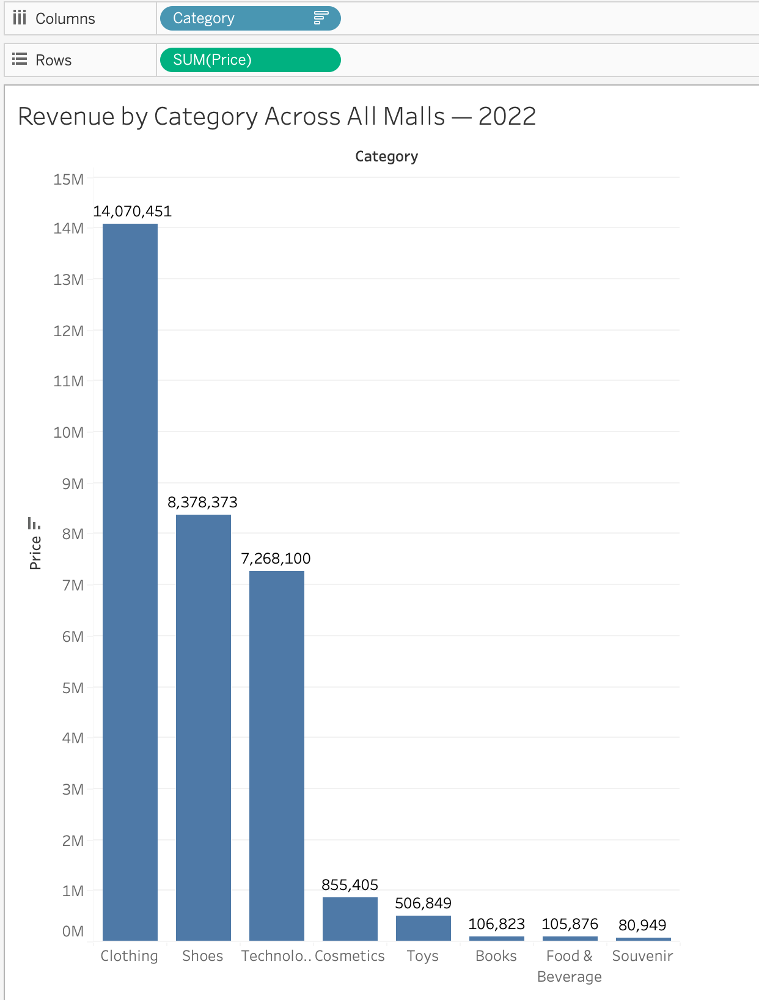

---

## Revenue by Shopping Mall, 2021

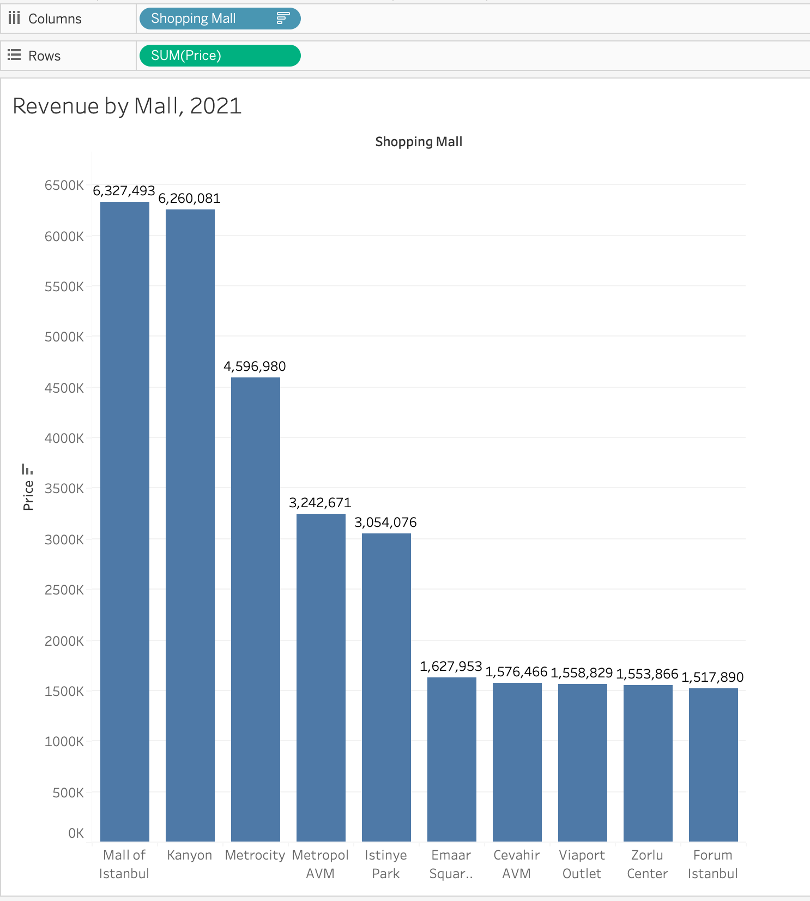

---

## Revenue by Shopping Mall, 2022

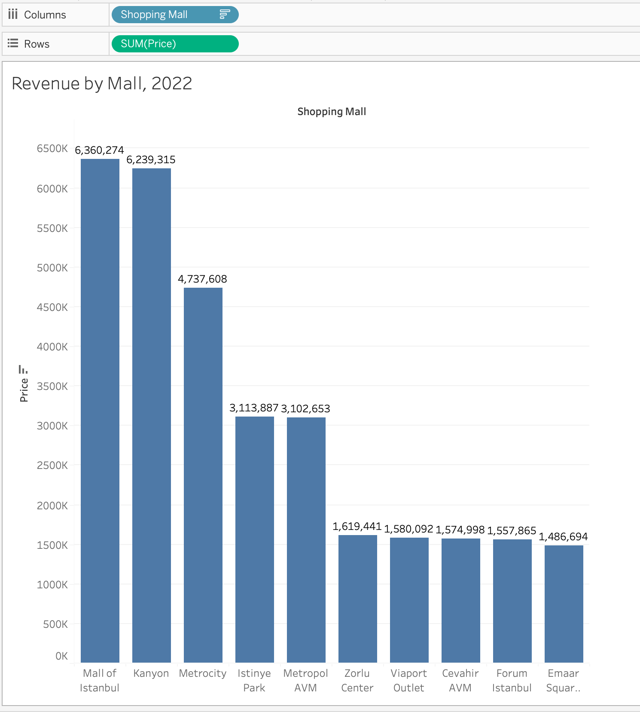

---

## Transactions by Shopping Mall, 2021

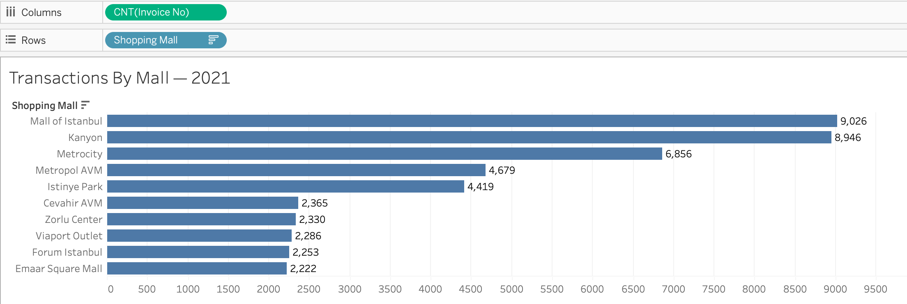

---

## Transactions by Shopping Mall, 2022

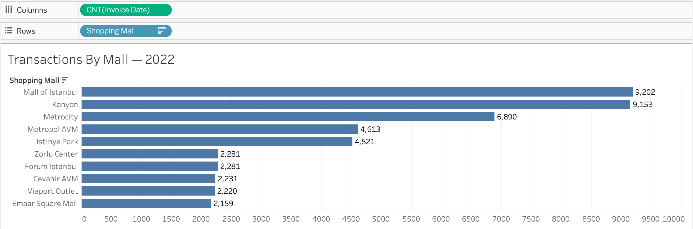

---

## Yearly Revenue Trend

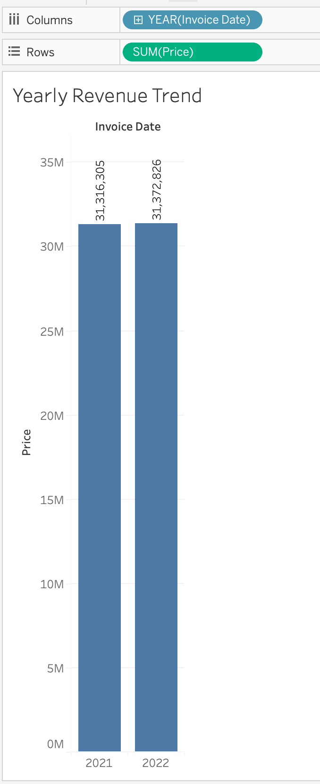

---

## Revenue by Gender, 2021

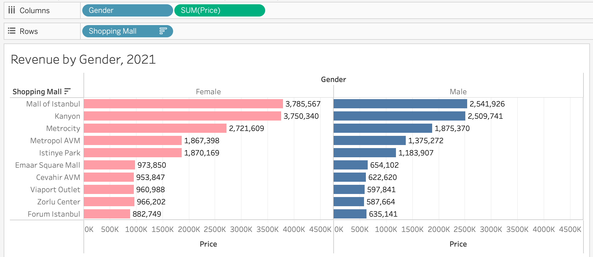

---

## Revenue by Gender, 2022

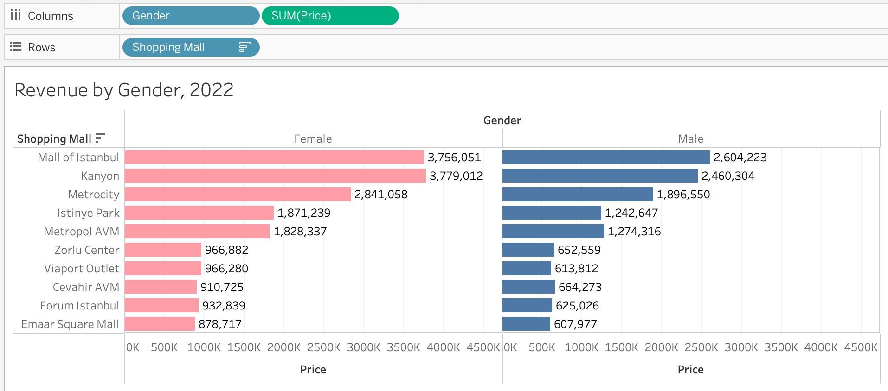

---

## Basket Size Distribution by Shopping Mall

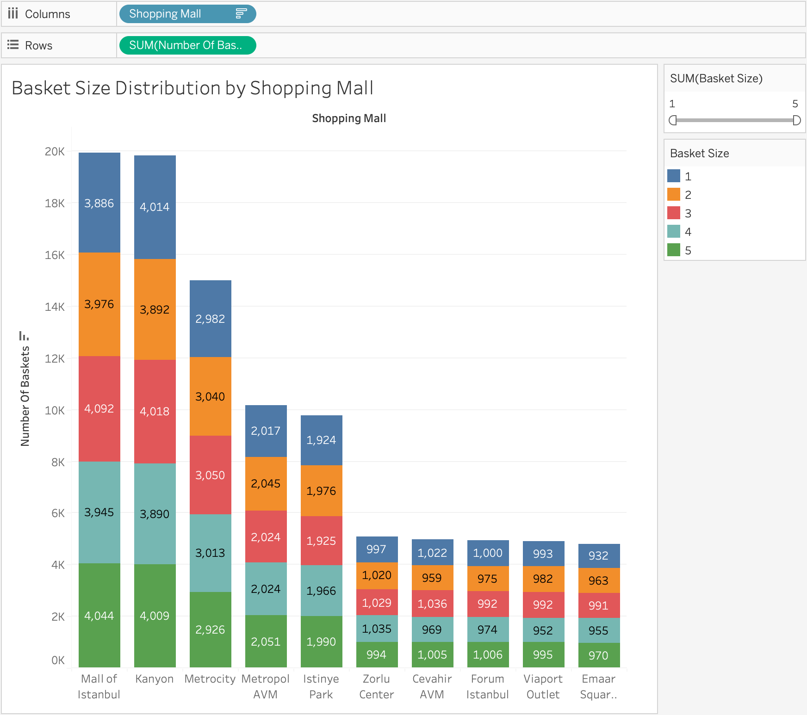

---

# Revenue Analysis (2021 vs 2022)

---

## 1. Total Revenue

| Year | Total Revenue |
|------|--------------|
| 2021 | 31,316,304.63 |
| 2022 | 31,372,826.18 |

**Change**
- Δ = +56,521.55
- Growth = +0.18%

---

## 2. Transactions & Basket Metrics

| Metric | 2021 | 2022 | Change |
|--------|------|------|--------|
| Transactions | 45,678 | 45,973 | +295 (+0.65%) |
| Avg Basket Size | 686.1 | 682.3 | -3.8 (-0.55%) |
| Revenue per Transaction | 686.0 | 682.8 | -3.2 (-0.47%) |

---

## 3. Monthly Revenue Comparison (Key Months)

| Month | 2021 Revenue | 2022 Revenue | Δ |
|------|--------------|--------------|----|
| July | 2,802,468.58 | 2,749,554.99 | -52,913.59 |
| October | 2,782,418.40 | 2,755,839.69 | -26,578.71 |

---

## 4. Category Contribution (2022 vs 2021)

This analysis compares category-level revenue differences between 2022 and 2021 to identify which product groups drove overall revenue changes.

| Category | Revenue Change (2022 vs 2021) |
|----------|-------------------------------|
| Clothing | -294,678.56 |
| Shoes | +136,238.59 |
| Technology | +163,800.00 |
| Cosmetics | +27,323.52 |
| Toys | +15,554.56 |
| Books | +6,756.90 |
| Souvenir | +1,829.88 |
| Food & Beverage | -303.34 |
---

## 5. Core Drivers Breakdown

### Core Decline

The overall revenue decline is primarily driven by:

- Clothing: -294,678.56

Clothing is the main negative contributor and represents the largest driver of the overall revenue decrease.

---

### Growth Drivers

Revenue growth is observed in the following categories:

- Technology: +163,800.00
- Shoes: +136,238.59
- 
---

## 6. Key Findings

- Total revenue is **stable (+0.18%)**
- Growth in transactions (+0.65%) was offset by lower basket size (-0.55%)
- Revenue decline is driven by:
    - Clothing
    - Shoes
- Growth is driven mainly by Technology
- July and October show noticeable YoY decline

---

## 7. Conclusion

Revenue structure changed, not volume:
- Core categories declined
- Smaller categories partially compensated
- Net result = flat revenue performance

---

##  Revenue Time Series & Forecasting

### Monthly Revenue Trend (2021–2022)

- 2021 monthly range: ~2.35M – 2.80M
- 2022 monthly range: ~2.31M – 2.75M

---

### Forecasting Approach

A scenario-based time series forecasting approach was applied.

The model assumes:
- continuation of historical monthly patterns
- no structural changes in customer behavior
- no external shocks (promotions, macroeconomic events)

Forecast is derived using trend extrapolation in Tableau based on historical monthly revenue series.

---

### Revenue trend and forecast visualization:

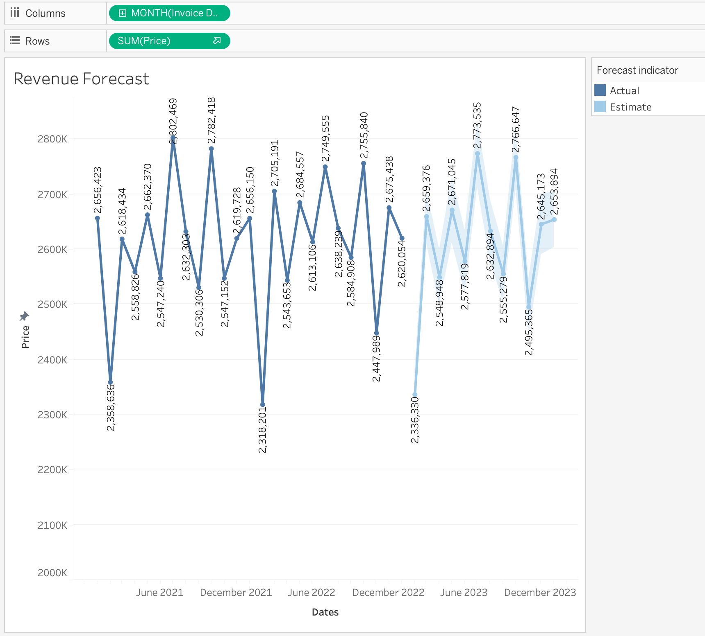

---

### Key Revenue Insights

- February consistently shows the lowest revenue across years.
- July and October are the strongest revenue months.
- September also shows relatively lower performance compared to peak months.
- Revenue remains stable overall, with fluctuations driven mainly by seasonality rather than growth trend.

---

### Additional Revenue Analysis

➡️ [Revenue Analysis & Seasonality](docs/business_insights/revenue_analysis_seasonality.md)

Includes a detailed comparison of peak revenue months and category-level analysis explaining why revenue was lower in 2022 than in 2021 during those periods.

