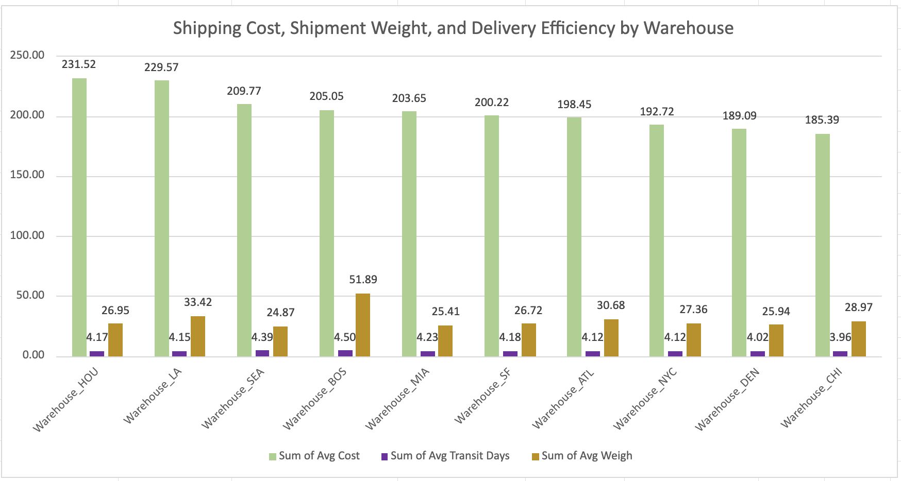
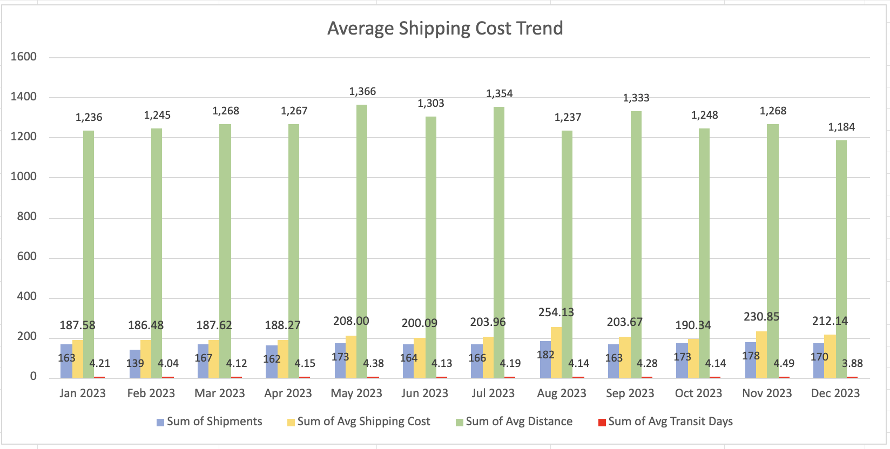

# US Logistics Performance Dataset

https://www.kaggle.com/datasets/shahriarkabir/us-logistics-performance-dataset

# Tools 

- Excel Cloud
- PowerPoint Cloud

## Data Cleaning

The dataset was reviewed and cleaned in Excel before analysis.

Quality checks included:
- Missing values analysis
- Duplicate detection
- Data type validation
- Invalid date checks
- Negative and zero value checks

Detailed cleaning documentation:
[Data Cleaning Report](analysis/01_Data_Cleaning.md)

## Exploratory Data Analysis (EDA)

Exploratory Data Analysis was performed to understand the dataset structure, summarize key variables, and identify patterns before conducting business analysis.

The original dataset contained **2,000 shipment records and 11 columns** related to shipment details, warehouse operations, carriers, costs, delivery status, and operational performance.

Original dataset fields included:

- Shipment_ID
- Origin_Warehouse
- Destination
- Carrier
- Shipment_Date
- Delivery_Date
- Weight_kg
- Cost
- Status
- Distance_miles
- Transit_Days

During data preparation and EDA, additional analytical columns were created:

- **Shipment_month** and **Delivery_month** — added to analyze monthly trends and seasonality.
- **Outlier flags** for Weight_kg, Cost, and Transit_Days — created using the IQR method to identify and evaluate extreme values.
- **Invalid_Date flag** — created to identify date inconsistencies.

### Overall Numerical Summary

Descriptive statistics were calculated for key operational variables:

| Variable | Average | Median | Minimum | Maximum | Outliers Identified |
|---|---:|---:|---:|---:|---:|
| Weight_kg | 30.20 kg | 20.70 kg | 0.20 kg | 5,404.20 kg | 111 |
| Cost | $205.16 | $196.42 | $17.89 | $6,562.21 | 4 |
| Distance_miles | 1,275.87 miles | 1,262.50 miles | 101 miles | 2,499 miles | 0 |
| Transit_Days | 4.18 days | 4 days | 1 day | 12 days | 35 |

### Outlier Analysis Summary

Potential outliers were investigated using the IQR method to determine whether they represented data errors or valid operational scenarios.

| Outlier Category | Criteria | Findings |
|---|---|---|
| Weight Outliers | Weight > 66.43 kg (111 shipments) | Outlier shipments had an average weight of **154.53 kg (+124.33 kg)**. Their average cost was **$272.09 (+$66.93)**, while transit time remained similar to normal shipments (**4.35 days, +0.17 days**). |
| Cost Outliers | Cost > $503.72 (4 shipments) | Outlier shipments had an average cost of **$3,793.01 (+$3,587.85)**. They did not have higher average weight (**25.25 kg, -4.95 kg**) but had longer distances (**1,872 miles, +596 miles**). |
| Transit Time Outliers | Transit_Days > 8 days (35 shipments) | Outlier shipments had an average transit time of **9.40 days (+5.22 days)**. Longer delivery times were associated with greater distance (**2,019 miles, +743 miles**) rather than shipment weight (**25.06 kg, -5.14 kg**). |

Based on the investigation, weight and transit time outliers were retained because they represented valid shipment scenarios. Cost outliers were retained but flagged for additional review because their unusually high costs could require further investigation.

Detailed EDA documentation:
[Exploratory Data Analysis Report](./eda/eda.md)

## Business Problem

The company ships products through multiple warehouses and carriers across the United States. Management needs to understand which factors drive transportation cost, delivery performance, and operational efficiency in order to optimize carrier selection, reduce shipping expenses, and improve service quality.

## Project Objective

The goal of this project is to analyze logistics operations and identify the main factors affecting transportation costs, delivery performance, and operational efficiency.
The analysis evaluates warehouse performance, monthly shipping trends, and carrier effectiveness to answer key business questions and provide recommendations for improving logistics decisions.

# Business Questions and Key Findings

## 1. What is the overall performance of the logistics network?

**Answer:**

- The company processed **2,000 shipments** in 2023 with total transportation costs of **$401.9K**.
- Shipments covered **2.55 million miles** with an average transportation cost of **$205.16 per shipment** and **$0.16 per mile**.
- The average transit time was **4.18 days**, showing a relatively consistent delivery cycle across the network.
- **82.4% of shipments were delivered without delays or other delivery issues**, while the remaining shipments required attention due to delays (**9.95%**), losses (**2.25%**), or other unresolved statuses.

---

## 2. Which warehouses operate most efficiently?

**Answer:**

- **Warehouse_CHI demonstrated the strongest overall performance**, combining the fastest average transit time (**3.96 days**) and the lowest average shipping cost (**$185.39**). Its average shipment weight (**28.97 kg**) was close to the network average, indicating that lower costs were not caused by significantly lighter shipments.
- **Warehouse_NYC achieved the highest on-time delivery performance (**88.8%**) and the lowest delayed shipment rate (**5.9%**), showing strong delivery execution despite handling the lowest shipment volume.
- **Warehouse_MIA and Warehouse_ATL require further review** due to weaker delivery outcomes. Warehouse_MIA had the lowest on-time delivery performance (**78.1%**) and the highest in-transit rate (**6.0%**), while Warehouse_ATL recorded the highest lost shipment rate (**4.35%**).

---

## 3. What factors are driving differences in transportation costs?

**Answer:**

- Shipment volume was one of the main drivers of total transportation spending. **Warehouse_LA and Warehouse_HOU handled the highest shipment volumes** (**220 and 212 shipments**) and generated the highest total transportation costs (**$49.6K and $48.2K**).
- Higher costs were not explained by shipment volume alone. For example, **Warehouse_LA had a higher average shipment weight (**33.42 kg**), which partially explains increased transportation costs, while Warehouse_HOU had similar shipment characteristics but higher costs requiring additional review.
- Monthly analysis showed that cost increases were not always related to longer distances. **August reached the highest average shipping cost ($254.13)** despite having a lower average shipping distance, suggesting that carrier pricing, shipment mix, or seasonal factors may influence costs.

---

## 4. Which carriers provide the best balance between cost and service quality?

**Answer:**

- **UPS demonstrated the strongest reliability performance**, achieving the highest percentage of shipments delivered without issues (**86.33%**) and **0% lost shipments**.
- **USPS provided the strongest cost efficiency**, with the lowest average shipping cost (**$182.66**) and one of the fastest average delivery times (**4.05 days**).
- **Amazon Logistics showed potential service quality concerns**, with the lowest percentage of shipments delivered without issues (**79.20%**) and the highest lost shipment rate (**4.38%**).
- **FedEx represented the highest transportation spend (**$64.1K**) and should be monitored because cost impact is significant despite not handling the largest shipment volume.

---

## 5. Were there seasonal trends affecting logistics performance?

**Answer:**

- Shipment volume remained relatively stable throughout the year, ranging from **139 shipments in February** to **182 shipments in August**.
- **August and November showed higher transportation costs**, but the increase was not fully explained by shipment volume or distance, indicating other factors such as carrier pricing or shipment characteristics.
- **December showed weaker delivery performance**, with the highest delay rate (**14.12%**) and the lowest percentage of shipments delivered without issues (**77.65%**), suggesting potential seasonal pressure on logistics operations.

---

## Detailed Reports

- **KPI Summary** – comprehensive overview of key logistics performance indicators, including delivery performance, costs, and operational metrics.  
  → [View KPI Summary](analysis/02_KPI_Summary.md)

- **Warehouse Analysis** – detailed analysis of warehouse performance, inventory movement, fulfillment efficiency, and regional differences.  
  → [View Warehouse Analysis](analysis/03_Warehouse_Analysis.md)

- **Monthly Analysis** – month-by-month trends, seasonality, and changes in operational performance over time.  
  → [View Monthly Analysis](analysis/04_Monthly_Analysis.md)

- **Carrier Analysis** – comparison of carriers based on delivery time, shipping costs, reliability, and overall performance.  
  → [View Carrier Analysis](analysis/05_Carrier_Analysis.md)

# Recommendations

Based on the analysis, the following actions are recommended:

- Review carrier allocation strategy by balancing reliability and cost. UPS provides strong service quality, while USPS provides lower transportation costs with competitive delivery speed.
- Investigate high-cost warehouses, especially Warehouse_LA and Warehouse_HOU, to identify opportunities related to carrier selection, routing, or shipment consolidation.
- Review Warehouse_MIA and Warehouse_ATL processes due to higher unresolved shipments and loss rates.
- Monitor high-cost periods such as August and November to understand whether pricing changes, shipment characteristics, or seasonal demand are affecting transportation expenses.
- Perform additional route-level analysis to identify specific warehouse-destination-carrier combinations causing delays or higher costs.

# Forecasting Analysis

## Forecasting Objective

After analyzing historical logistics performance, forecasting models were applied to estimate future operational trends and support better planning decisions.
The goal of forecasting is to help management anticipate future shipment demand, transportation costs, and potential delivery capacity requirements.
Three forecasting approaches were selected based on the business questions identified during the analysis:

- Forecast Monthly Shipment Volume
- Forecast Monthly Transportation Cost
- Forecast Average Delivery Time

## Forecast Monthly Shipment Volume

**Business Question:**  
How many shipments should the company expect in future months?

**Forecasting Method:**
- Moving Average
- Linear Trend
- Exponential Smoothing

**Why this forecast was selected:**

Shipment volume directly affects warehouse workload, carrier capacity planning, and transportation resource allocation. Forecasting future shipment demand helps determine whether additional operational capacity or carrier resources may be required.
Monthly shipment volume was selected because it showed recurring operational patterns throughout the year and provides a foundation for planning future logistics activity.

## Forecast Monthly Transportation Cost

**Business Question:**  
How much transportation spending should the company expect in future months?

**Forecasting Method:**
- Linear Trend
- Exponential Smoothing

**Why this forecast was selected:**

Transportation cost is one of the largest operational expenses in logistics. Forecasting future costs helps management improve budgeting, identify potential cost increases, and evaluate whether spending changes are driven by shipment volume, pricing changes, or other factors.
Monthly transportation cost was selected because the analysis showed that cost fluctuations were not always explained only by shipment volume or distance.

## Forecast Average Delivery Time

**Business Question:**  
What delivery performance level should the company expect in future months?

**Forecasting Method:**
- Moving Average
- Exponential Smoothing

**Why this forecast was selected:**

Average transit time is a key service performance indicator. Forecasting delivery time helps identify potential decreases in operational efficiency and supports proactive actions to maintain delivery standards.
Transit time was selected because delivery speed remained relatively stable throughout the year, making it suitable for identifying future trends and changes in operational performance.

