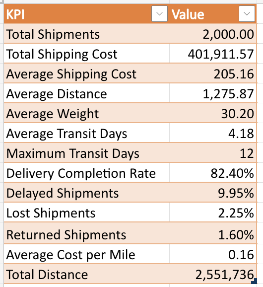

# Logistics KPI Summary

## Overview

This report provides an overview of logistics performance across **2,000 shipments** processed in **2023**.

The analysis covers **10 warehouses**:

- Warehouse_ATL
- Warehouse_BOS
- Warehouse_CHI
- Warehouse_DEN
- Warehouse_HOU
- Warehouse_LA
- Warehouse_MIA
- Warehouse_NYC
- Warehouse_SEA
- Warehouse_SF

---

## Key Findings

- The logistics network processed **2,000 shipments** and generated **$401.9K in total revenue** during 2023.
- Shipments covered more than **2.55 million miles**, with an average shipment distance of **1,275.87 miles**.
- Transportation costs averaged **$205.16 per shipment** and **$0.16 per mile**.
- Average delivery time was **4.18 days**, with the longest delivery taking **12 days**.
- - **82.40% of shipments** were successfully delivered without delays or delivery issues.
- Delivery issues included **9.95% delayed shipments**, **2.25% lost shipments**, and **1.60% returned shipments**.
