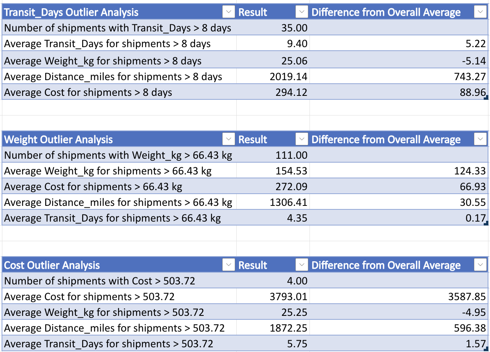

## Exploratory Data Analysis (EDA) - Descriptive Statistics

Descriptive statistics were calculated to summarize the main characteristics of numerical variables and understand data distribution before further analysis.

The dataset includes shipment information such as:

- **Shipment_ID** — unique shipment identifier
- **Origin_Warehouse** — warehouse where the shipment started
- **Destination** — delivery destination
- **Carrier** — shipping provider
- **Shipment_Date / Shipment_month** — shipment date and month
- **Delivery_Date / Delivery_month** — delivery date and month
- **Weight_kg** — shipment weight
- **Cost** — shipping cost
- **Status** — shipment status (Delivered, Delayed, Returned, Lost, In Transit)
- **Distance_miles** — shipment distance
- **Transit_Days** — delivery duration

The following metrics were analyzed for numerical variables (**Weight_kg, Cost, Distance_miles, Transit_Days**):

- Mean and Median
- Minimum and Maximum values
- Standard Deviation
- Quartiles (Q1 and Q3)
- IQR-based outlier detection

The results are shown below:

The analysis helped identify data distribution patterns and potential outliers that require further investigation during shipment performance analysis.

## Outlier Investigation

Potential outliers were identified using the IQR method and further analyzed to determine whether they represent data errors or valid operational scenarios.

### Transit_Days Outlier Analysis

Shipments with Transit_Days above 8 days (35 shipments) do not appear to be caused by unusually heavy cargo. Their average weight was **25.06 kg**, which is **5.14 kg below the overall average**. However, these shipments had a significantly higher average distance of **2,019 miles (+743 miles)** and a higher average cost of **$294.12 (+$88.96)**.
These records were retained in the analysis because longer delivery times appear to be explained by longer shipping distances rather than data quality issues. Removing these shipments would underestimate actual delivery times for long-distance shipments.

---

### Weight Outlier Analysis

Heavy shipments (111 shipments above 66.43 kg) had an average weight of **154.53 kg**, which is **124.33 kg higher than the overall average**. Despite their increased weight, the average transit time remained similar to normal shipments (**4.35 days, +0.17 days**). The average cost was higher at **$272.09 (+$66.93)**, which is consistent with heavier shipments requiring more resources.
These records were retained because they represent valid high-volume shipments. Removing them would distort the relationship between shipment weight and shipping cost.

---

### Cost Outlier Analysis

High-cost shipments (4 shipments above $503.72) had an average cost of **$3,793.01**, which is **$3,587.85 higher than the overall average**. However, these shipments did not have higher average weight (**25.25 kg, -4.95 kg below average**). They had longer distances (**1,872 miles, +596 miles**) and slightly longer transit times (**5.75 days, +1.57 days**).
These records were not removed automatically because the high costs may represent valid operational cases, such as special shipping services or carrier pricing differences. However, they should be reviewed separately before performing cost-related analysis.