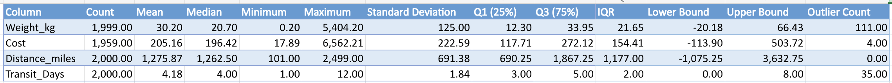

## Exploratory Data Analysis (EDA) - Descriptive Statistics

Descriptive statistics were calculated to summarize the main characteristics of numerical variables and understand data distribution before further analysis.

The dataset includes shipment information such as:

- **Shipment_ID** — unique shipment identifier
- **Origin_Warehouse** — warehouse where the shipment started
- **Destination** — delivery destination
- **Carrier** — shipping provider
- **Shipment_Date / Shipment_month** — shipment date and month
- **Delivery_Date / Delivery_month** — delivery date and month
- **Weight_kg** — shipment weight
- **Cost** — shipping cost
- **Status** — shipment status (Delivered, Delayed, Returned, Lost, In Transit)
- **Distance_miles** — shipment distance
- **Transit_Days** — delivery duration

The following metrics were analyzed for numerical variables (**Weight_kg, Cost, Distance_miles, Transit_Days**):

- Mean and Median
- Minimum and Maximum values
- Standard Deviation
- Quartiles (Q1 and Q3)
- IQR-based outlier detection

The results are shown below:

The analysis helped identify data distribution patterns and potential outliers that require further investigation during shipment performance analysis.