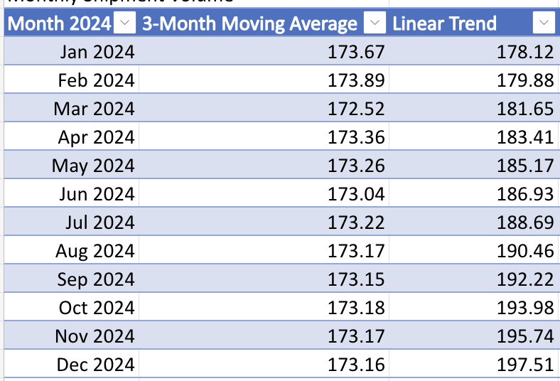
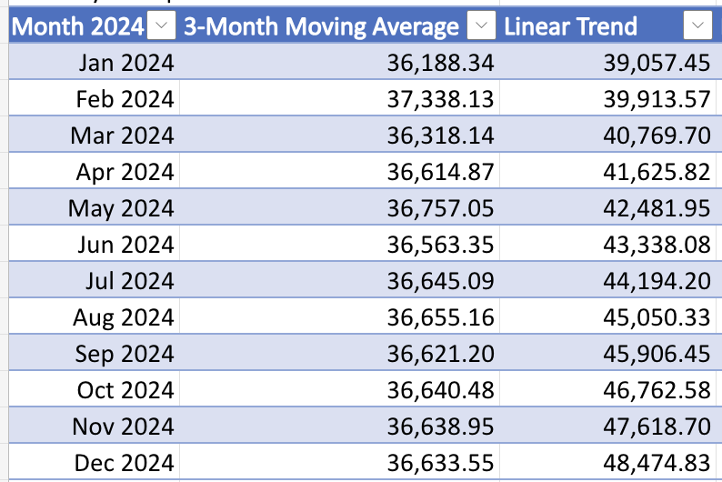
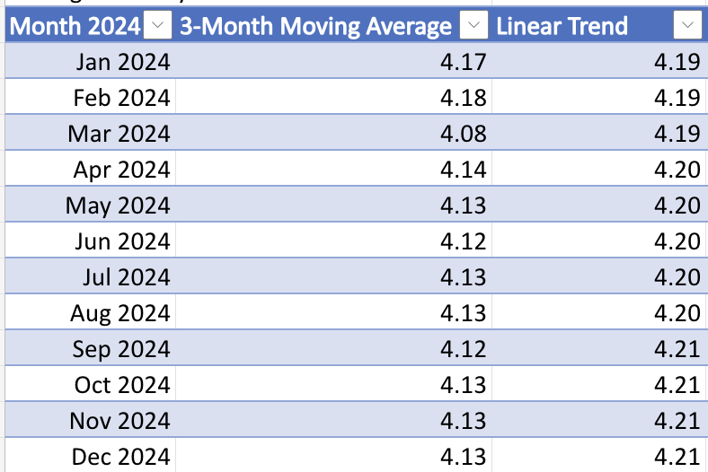

# Forecasting Analysis

## Forecasting Objective

After completing the historical logistics analysis, forecasting models were applied to estimate future operational trends and support planning decisions.

The goal of forecasting is to evaluate expected shipment demand, transportation spending, and delivery performance in order to support decisions related to warehouse capacity, carrier planning, budgeting, and service level management.

The dataset contains only one year of historical data (2023); therefore, simple forecasting methods were selected. More complex seasonal models require longer historical periods to reliably identify recurring patterns.

The following forecasting methods were applied:

- **3-Month Moving Average** — selected to smooth short-term fluctuations and estimate future values based on recent operational performance.
- **Linear Trend Forecast** — selected to identify whether historical data shows an overall increasing or decreasing direction.

Three operational metrics were selected for forecasting:

- **Monthly Shipment Volume** — affects warehouse workload, carrier capacity requirements, and operational planning.
- **Monthly Transportation Cost** — represents a major operational expense and supports future budgeting decisions.
- **Average Delivery Time** — measures service performance and helps identify potential changes in delivery efficiency.

Forecast results are shown below.

---

# Forecast Monthly Shipment Volume

## Business Question

**How many shipments should the company expect in future months?**

Forecasting shipment volume helps estimate future workload requirements, including warehouse capacity, transportation resources, and carrier demand.

## Forecast Interpretation

Two forecasting approaches produced different scenarios.

The **3-Month Moving Average** predicts a stable shipment volume of approximately **173 shipments per month throughout 2024**. The forecast remains almost unchanged from January (**173.67 shipments**) to December (**173.16 shipments**), indicating that recent shipment activity does not show strong growth or decline.
The **Linear Trend Forecast** predicts gradual growth from **178.12 shipments in January 2024** to **197.51 shipments in December 2024**. This represents an increase of approximately **19 shipments over the forecast period**.
Historical shipment volume in 2023 fluctuated between **139 and 182 shipments per month** without a consistent upward trend. Because the dataset does not demonstrate a clear growth pattern, the Moving Average forecast provides a more realistic short-term estimate.

**Recommended approach for this dataset:**

The **3-Month Moving Average** is more suitable for operational planning because shipment volume remained relatively stable during 2023. The Linear Trend forecast can be used as a growth scenario if business expansion or increased demand is expected.

---

# Forecast Monthly Transportation Cost

## Business Question

**How much transportation spending should the company expect in future months?**

Transportation cost forecasting helps support budgeting decisions and identify potential changes in future operational expenses.

## Forecast Interpretation

The two forecasting methods produced different cost expectations.
The **3-Month Moving Average** predicts relatively stable monthly transportation costs around **$36.6K throughout 2024**. Forecast values remain within a narrow range:

- January: **$36.2K**
- December: **$36.6K**

This indicates that recent cost fluctuations may represent normal variation rather than a consistent increase.
The **Linear Trend Forecast** predicts continuous cost growth from **$39.1K in January 2024** to **$48.5K in December 2024**.
Historical transportation costs showed fluctuations rather than a stable upward trend:

- August 2023: **$44.5K**
- September 2023: **$31.8K**
- November 2023: **$40.4K**

These changes suggest that transportation costs may depend on additional factors such as shipment characteristics, carrier pricing, and operational conditions.

**Recommended approach for this dataset:**

The **3-Month Moving Average** provides a more reliable short-term budgeting estimate because historical costs showed significant monthly variation without a consistent growth pattern. The Linear Trend forecast should be considered as a higher-cost scenario for planning purposes.

---

# Forecast Average Delivery Time

## Business Question

**What delivery performance level should the company expect in future months?**

Average delivery time forecasting helps monitor service performance and identify potential changes in operational efficiency.

## Forecast Interpretation

Both forecasting methods produced very similar results, indicating stable delivery performance.
The **3-Month Moving Average** predicts average delivery time between **4.08 and 4.18 days** throughout 2024.
The **Linear Trend Forecast** predicts almost no change, increasing only from **4.19 days in January 2024** to **4.21 days in December 2024**.
The small difference between the models reflects the stability of historical delivery times. The 2023 data did not show a strong increasing or decreasing trend in transit time.

**Recommended approach for this dataset:**

Both forecasting methods are appropriate because they produce nearly identical results. The Moving Average forecast is preferable for short-term operational monitoring, while the Linear Trend confirms that no significant change in delivery performance is expected.