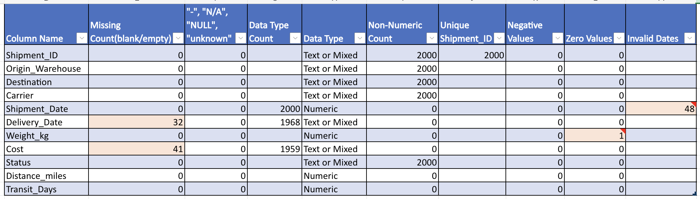

# Data Cleaning Report

## Dataset Overview

The dataset contains 2,000 shipment records.

Before performing analysis, the dataset was reviewed to identify data quality issues and ensure accuracy of the analysis.

## Data Quality Checks Performed

The following validation checks were performed using Microsoft Excel:

- Missing values analysis
- Duplicate Shipment_ID detection
- Data type validation
- Invalid date checks
- Negative and zero value checks
- Text value validation (N/A, NULL, unknown)

## Data Quality Findings

| Issue | Column | Count | Action Taken |
|---|---|---:|---|
| Missing values | Delivery_Date | 32 | Left unchanged because the actual delivery dates were unknown. These records were excluded only from delivery time calculations. |
| Missing values | Cost | 41 | Left unchanged because the correct values were unavailable. These records were excluded from cost-related calculations where necessary. |
| Invalid delivery dates (Delivery_Date < Shipment_Date) | Delivery_Date | 16 | Cleared the invalid Delivery_Date values because the correct dates could not be determined. |
| Zero value | Weight_kg | 1 | Replaced the zero value with a blank because shipment weight cannot be zero. |
| Duplicate Shipment_IDs | Shipment_ID | 0 | No duplicates found. |
| Negative values | Numeric columns | 0 | No negative values found. |
| Invalid text values (N/A, NULL, unknown) | All columns | 0 | No invalid text values found. |

## Data Type Corrections

The following columns were standardized:

- Shipment_Date → Date format
- Delivery_Date → Date format
- Weight_kg → Numeric format
- Cost → Numeric format

## Data Preparation for Analysis

Additional calculated columns were created to support future analysis:

- Shipment Year Month
- Delivery Year Month

These fields will be used for time-based analysis, trend identification, and dashboard visualizations.

## Final Dataset

The cleaned dataset was prepared for analysis with the following improvements:

- Missing values were documented and handled appropriately for analysis.
- Invalid delivery dates were cleared while preserving the remaining shipment information.
- Date and numeric formats were standardized.
- Text values were checked for consistent formatting and capitalization.
- Text fields were verified to have no unnecessary leading or trailing spaces.
- Shipment_ID values were confirmed to be unique.

The cleaned dataset was used for further analysis and dashboard creation.