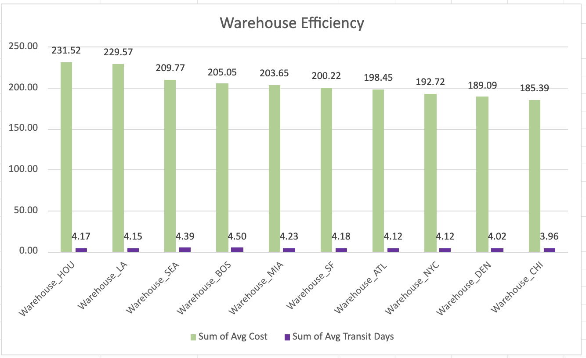

# Warehouse Performance Analysis

This analysis evaluates warehouse performance across **10 warehouses** using shipment volume, total shipping cost, transportation efficiency, delivery speed, and delivery reliability metrics.

---

## Shipment Volume and Total Shipping Cost

### Key Findings

- **Warehouse_LA** handled the largest operational workload, processing **220 shipments** with a total shipping cost of **$49.6K**.
- **Warehouse_HOU** ranked second with **212 shipments** and **$48.2K** in total shipping cost, indicating a similarly high level of operational activity.
- **Warehouse_NYC** processed the fewest shipments (**170**) and recorded the lowest total shipping cost (**$31.6K**). However, lower operating cost is expected with lower shipment volume and should be interpreted together with operational performance metrics shown below.

---

## Transportation Cost Efficiency

### Key Findings

- **Warehouse_LA** recorded the highest transportation cost per mile (**$0.19**), followed by **Warehouse_HOU** (**$0.17**). Since both warehouses also process the highest shipment volumes, additional analysis is needed to determine whether these higher costs are driven by longer routes, carrier selection, heavier shipments, or other operational factors.
- **Warehouse_SF** covered the greatest transportation distance (**279.5K miles**) while maintaining a cost per mile of only **$0.15**, indicating strong transportation efficiency despite supporting one of the largest delivery networks.
- Most warehouses operated within a narrow range of **$0.15–$0.16 per mile**, suggesting that transportation costs are generally consistent across the warehouse network.

---

## Warehouse Efficiency

### Key Findings

- **Warehouse_CHI** achieved the fastest average transit time (**3.96 days**), closely followed by **Warehouse_DEN** (**4.02 days**), indicating highly efficient delivery operations.
- **Warehouse_BOS** recorded the longest average transit time (**4.50 days**), suggesting that route complexity, carrier performance, or warehouse operations should be investigated further.
- Although **Warehouse_LA** and **Warehouse_HOU** have the highest average shipping costs, they also process the largest shipment volumes. Their operating costs should therefore be evaluated together with shipment volume, transportation distance, and cost per mile rather than independently.

---

## Delivery Performance

### Key Findings

- **Warehouse_NYC** demonstrated the strongest delivery performance, achieving the highest delivery completion rate (**88.8%**) while maintaining the lowest delay rate (**5.9%**). Despite processing the lowest shipment volume, its operational execution appears to be the most consistent.
- **Warehouse_CHI** combined one of the highest delivery completion rates (**85.8%**) with the fastest average transit time (**3.96 days**), making it one of the strongest overall performers.
- **Warehouse_MIA** recorded the lowest delivery completion rate (**78.1%**) and the highest percentage of shipments remaining in transit (**6.0%**), indicating potential operational bottlenecks or carrier-related delays.
- **Warehouse_ATL** experienced the highest lost shipment rate (**4.35%**), making shipment tracking and loss prevention an important area for operational review.

---

# Overall Insights and Recommendations

The warehouse network shows relatively balanced workloads, with no single warehouse handling a disproportionate share of shipments. However, operational performance varies considerably once transportation cost, delivery speed, and service quality are evaluated together.

**Warehouse_LA** and **Warehouse_HOU** support the largest shipping volumes, making them critical distribution centers. Their higher total shipping costs are expected given their workload, but their higher cost per mile suggests opportunities to optimize carrier selection, route planning, or shipment consolidation.

**Warehouse_NYC** demonstrates that strong operational performance is not solely dependent on shipment volume. Although it handles the fewest shipments, it achieves the highest delivery completion rate and the lowest delay rate. Its operational practices could serve as a benchmark for improving other warehouses.

**Warehouse_CHI** consistently performs well across multiple metrics, combining fast delivery times with high delivery reliability. This indicates an efficient balance between operational speed and service quality.

Several warehouses require additional investigation. **Warehouse_MIA** should be reviewed due to its low delivery completion rate and high percentage of shipments still in transit, while **Warehouse_ATL** should be prioritized for loss prevention initiatives because of its higher lost shipment rate. **Warehouse_BOS** also warrants further analysis to determine why transit times are consistently longer than those of other warehouses.

To better understand the drivers behind these performance differences, the next phase of analysis should focus on **monthly trends**, **carrier performance**, and **destination-level analysis**. These additional perspectives will help determine whether operational issues are seasonal, carrier-specific, or concentrated on particular shipping routes.