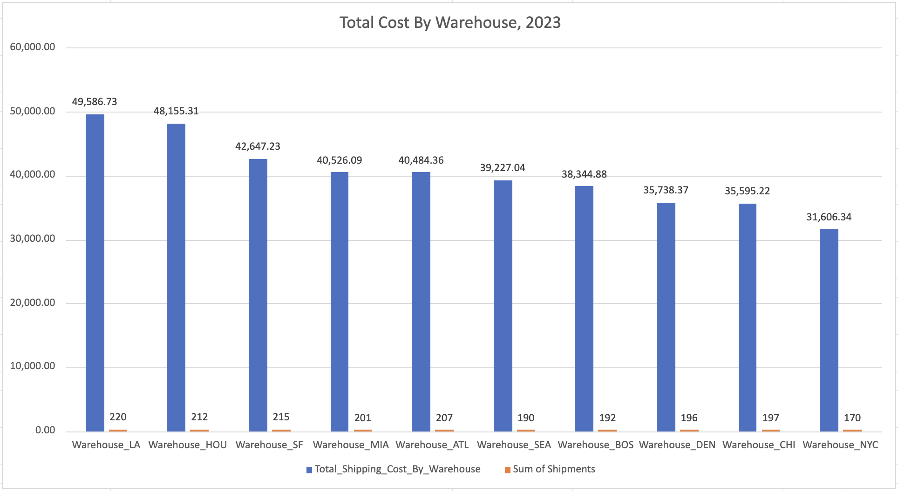
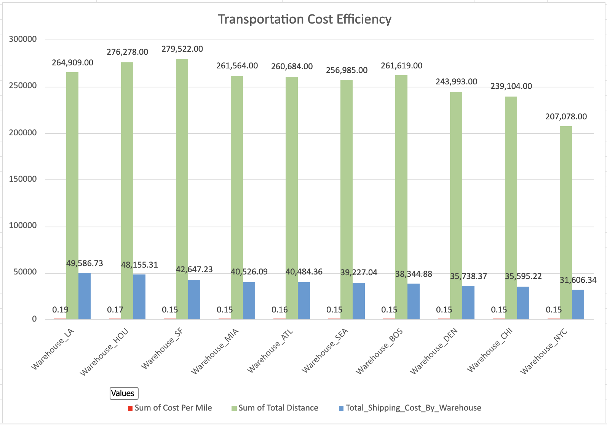
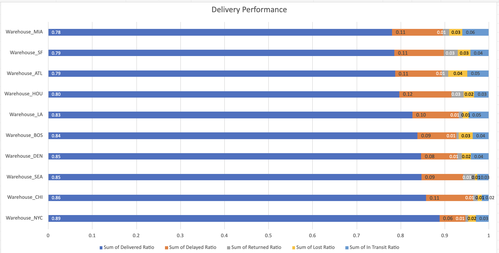

# Warehouse Performance Analysis

## Warehouse Performance Analysis

This analysis evaluates performance across 10 warehouses by comparing shipment volume, transportation costs, cost efficiency, delivery speed, and delivery outcomes. The analysis focuses on identifying differences in operational workload, transportation efficiency, and delivery performance to understand which warehouses operate most effectively and where potential improvement opportunities exist.

---

## Shipment Volume and Total Shipping Cost

### Key Findings

- **Warehouse_LA** handled the largest operational workload, processing **220 shipments** with a total shipping cost of **$49,586.73**.
- **Warehouse_HOU** ranked second with **212 shipments** and **$48,155.31** in total shipping cost, indicating a similarly high level of operational activity.
- **Warehouse_NYC** processed the fewest shipments (**170**) and recorded the lowest total shipping cost (**$31,606.34**). However, lower operating cost is expected with lower shipment volume and should be interpreted together with operational performance metrics shown below.

---

## Transportation Cost Efficiency

### Key Findings

- **Warehouse_LA** recorded the highest transportation cost per mile (**$0.19**), followed by **Warehouse_HOU** (**$0.17**). 
- **Warehouse_SF** covered the greatest transportation distance (**279.5K miles**) while maintaining a cost per mile of only **$0.15**, indicating strong transportation efficiency despite supporting one of the largest delivery networks.
- Most warehouses operated within a narrow range of **$0.15–$0.16 per mile**, suggesting that transportation costs are generally consistent across the warehouse network.

---

## Shipping Cost, Shipment Weight, and Delivery Efficiency by Warehouse

### Key Findings

- **Warehouse_CHI demonstrated the strongest operational efficiency**, achieving the lowest average shipping cost (**$185.39**) and the fastest average transit time (**3.96 days**). Its average shipment weight (**28.97 kg**) was close to the network average, suggesting that lower costs were likely related to transportation efficiency rather than significantly lighter shipments.
- **Warehouse_HOU and Warehouse_LA recorded the highest average shipping costs** (**$231.52** and **$229.57** respectively). Warehouse_LA handled heavier shipments (**33.42 kg**), which may partially explain its higher costs, while Warehouse_HOU had a similar shipment weight (**26.95 kg**) but higher costs, indicating that carrier selection, routes, or pricing structure may require further review.
- **Warehouse_BOS had the longest average transit time (**4.50 days**) and the highest average shipment weight (**51.89 kg**). The combination of heavier shipments and slower delivery speed suggests that shipment characteristics may be contributing to lower transportation efficiency.

---

## Delivery Performance

### Key Findings

- **Warehouse_NYC demonstrated the strongest delivery performance**, with **88.8% of shipments successfully delivered without delay or other status issues** and the lowest delayed shipment rate (**5.9%**). Despite handling the lowest shipment volume, the warehouse showed consistent operational performance.
- **Warehouse_CHI showed strong operational performance**, with **85.8% of shipments successfully delivered without delay or other issues** and the fastest average transit time (**3.96 days**), indicating efficient shipment processing and transportation execution.
- **Warehouse_MIA showed the weakest delivery performance**, with the lowest percentage of successfully delivered shipments (**78.1%**) and the highest in-transit rate (**6.0%**), indicating that more shipments remained unresolved compared with other warehouses.
- **Warehouse_ATL recorded the highest lost shipment rate (**4.35%**), highlighting a potential need to review shipment tracking and loss prevention processes.

---

# Overall Insights and Recommendations

- **Warehouse_CHI showed the strongest overall performance**, combining the fastest average transit time (**3.96 days**), the lowest average shipping cost (**$185.39**), and the highest on-time delivery rate (**85.8%**). Its average shipment weight (**28.97 kg**) was close to the network average, suggesting that strong performance was driven by operational efficiency rather than lighter shipments.
- **Warehouse_LA and Warehouse_HOU require cost optimization review.** They handled the highest shipment volumes (**220 and 212 shipments**) and generated the highest total shipping costs (**$49.6K and $48.2K**). Warehouse_LA’s higher average shipment weight (**33.42 kg**) partially explains its higher cost, while Warehouse_HOU had a similar weight profile (**26.95 kg**) but higher transportation costs, indicating potential opportunities to review carrier selection, routing, or pricing.
- **Warehouse_NYC achieved the strongest delivery performance**, with the highest on-time delivery rate (**88.8%**) and the lowest delayed shipment rate (**5.9%**). Despite processing the lowest shipment volume, its results indicate consistent delivery execution and provide a potential benchmark for other warehouses.
- **Warehouse_MIA and Warehouse_ATL require additional investigation.** Warehouse_MIA recorded the lowest on-time delivery rate (**78.1%**) and the highest in-transit rate (**6.0%**), while Warehouse_ATL had the highest lost shipment rate (**4.35%**). These locations should be reviewed for potential issues related to carrier performance, shipment tracking, and operational processes.
- **Future analysis should focus on carrier and route-level performance** to identify the main drivers behind cost differences and delivery issues. This analysis can help determine whether performance gaps are related to specific carriers, destinations, or transportation patterns.