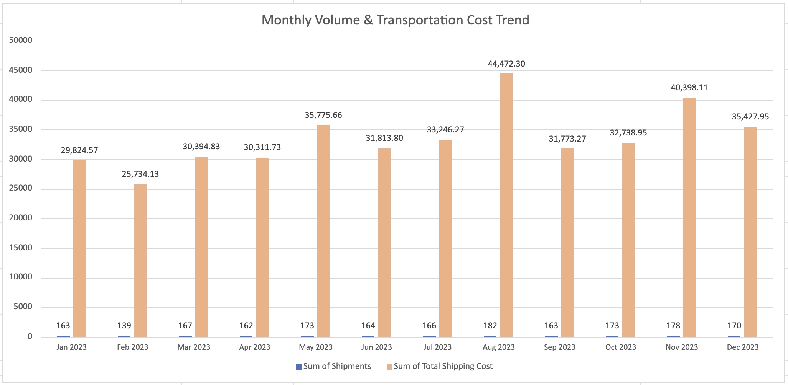
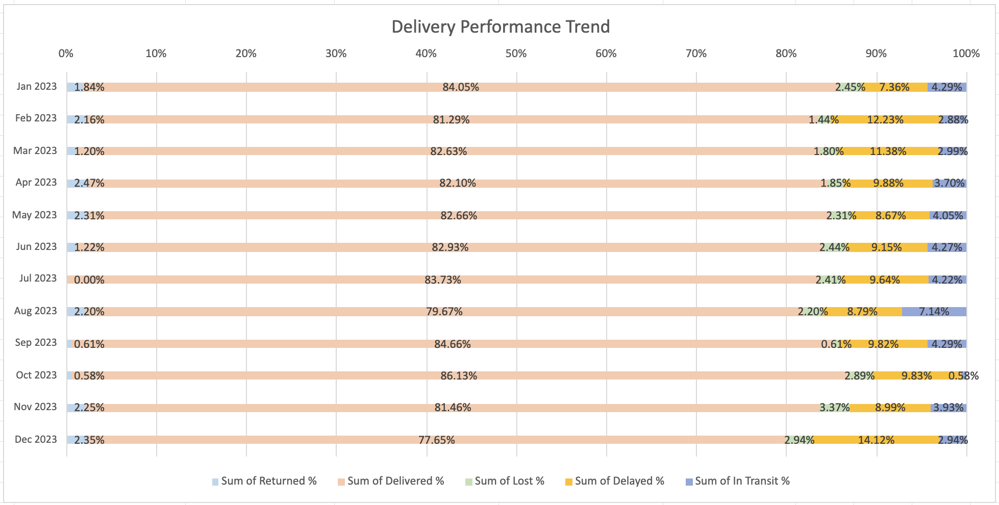
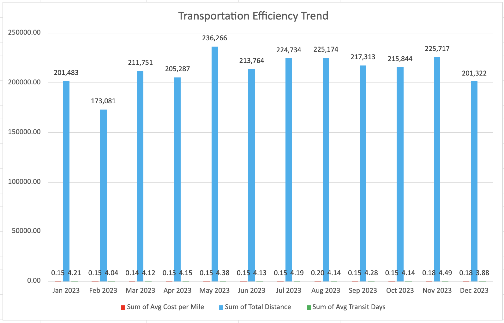

# Monthly Analysis

## Monthly Shipping Volume & Transportation Cost Trend

### Key Findings

- Shipment volume remained relatively stable throughout the year, ranging from **139 shipments in February** to **182 shipments in August**.
- **August** recorded both the highest shipment volume (**182**) and the highest total shipping cost (**$44.5K**), indicating a peak in transportation activity.
- Shipping costs generally increased during the second half of the year, with another noticeable peak in **November ($40.4K)** despite handling fewer shipments than August.
- The difference in monthly shipment volume is relatively small, while transportation costs fluctuate much more, suggesting that factors beyond shipment count influence overall costs.

---

## Average Shipping Cost Trend

### Key Findings

- Average shipping cost remained fairly consistent during the first half of the year (approximately **$186–208** per shipment).
- **August** experienced the highest average shipping cost (**$254.13**) even though the average shipping distance (**1,237 miles**) was lower than in several other months. This suggests that higher costs were not driven solely by longer routes.
- **November** combined one of the highest average shipping costs (**$230.85**) with the longest average transit time (**4.49 days**), indicating a period of lower operational efficiency.
- **December** presents an interesting contrast: shipments traveled the shortest average distance (**1,184 miles**) and had the fastest transit time (**3.88 days**), yet the average shipping cost remained relatively high (**$212.14**). This may indicate changes in carrier pricing, shipment characteristics, or seasonal demand.

---

## Delivery Performance Trend

### Key Findings

- Delivery performance was generally stable throughout most of the year, with delivered shipments remaining above **81%** in nearly every month.
- **October** achieved the highest delivery completion rate (**86.13%**) while maintaining one of the lowest in-transit rates (**0.58%**), suggesting efficient shipment completion.
- **December** showed the weakest delivery performance, with the lowest delivery rate (**77.65%**) and the highest delay rate (**14.12%**). This pattern may reflect seasonal shipping pressure during the holiday period.
- Lost shipment rates remained relatively low overall but increased during **November (3.37%)** and **December (2.94%)**, making these months worth further investigation.

---

## Transportation Efficiency Trend

### Key Findings

- Transportation distance remained relatively consistent throughout the year, with most months ranging between **200K and 236K miles**.
- **May** recorded the highest transportation distance (**236K miles**), while **August** showed the highest average cost per mile (**$0.20**), indicating that increased transportation costs were not driven solely by distance.
- **November** combined a higher cost per mile (**$0.18**) with the longest average transit time (**4.49 days**), suggesting reduced transportation efficiency during that period.

---

# Overall Insights

- Monthly shipment volume remained relatively stable throughout the year, while transportation costs varied considerably. This indicates that shipment count alone does not explain fluctuations in total shipping cost.
- Cost increases in **August** and **November** appear to be influenced by factors beyond shipping distance, such as carrier pricing, shipment mix, or seasonal demand. These periods should be reviewed in more detail.
- Delivery performance was strongest in **October**, while **December** experienced the highest delays and the lowest delivery completion rate. Seasonal demand may have contributed to this decline, but carrier and route performance should also be evaluated.
- Future analysis should compare **carrier performance**, **destination routes**, and **warehouse activity by month** to identify the primary drivers of higher transportation costs and reduced delivery performance.