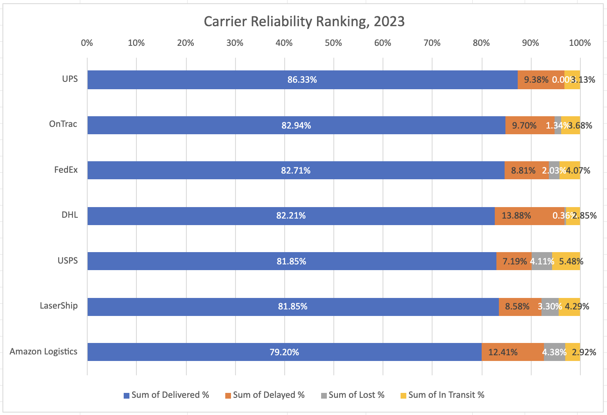
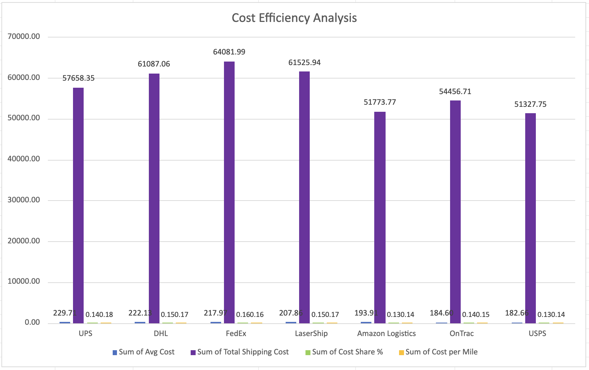
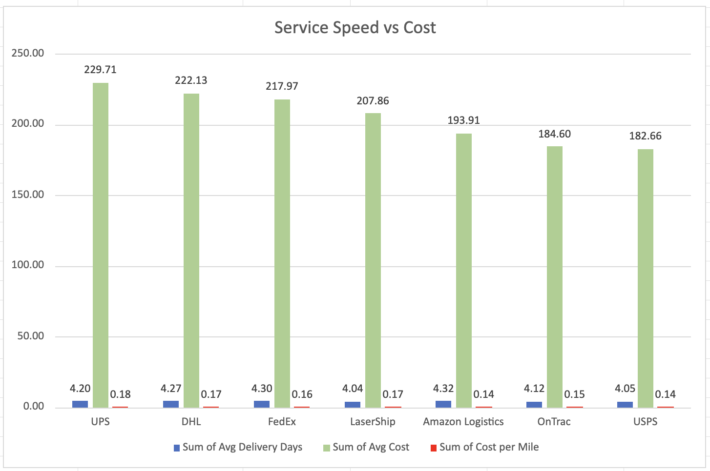
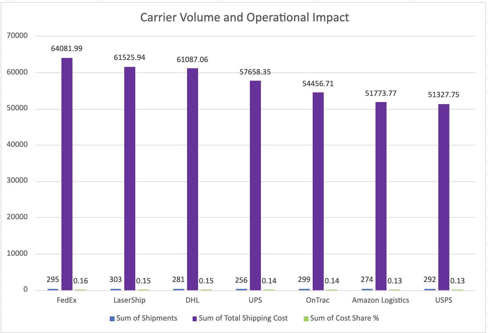

# Carrier Performance Analysis

## Carrier Reliability Performance

### Key Findings

- **UPS achieved the strongest delivery reliability**, with the highest delivered rate (**86.33%**) and **0% lost shipments**, indicating the most consistent shipment completion performance among all carriers.

- **Amazon Logistics showed the weakest reliability profile**, with the lowest delivered rate (**79.20%**) and the highest lost shipment rate (**4.38%**). This suggests that shipment quality issues may be affecting overall carrier performance.

- **DHL had the highest delay rate (**13.88%**) despite maintaining a relatively low lost shipment rate (**0.36%**). This indicates that DHL's primary issue is delivery timeliness rather than shipment loss.

- **USPS presented a mixed performance pattern**: it achieved the lowest delay rate (**7.19%**) but had one of the highest lost shipment rates (**4.11%**) and in-transit rates (**5.48%**), suggesting potential issues with shipment completion after dispatch.

---

## Carrier Cost Efficiency Analysis

### Key Findings

- Total transportation spending reached **$401.9K** in 2023. **FedEx represented the largest cost share (**16%**) with **$64.1K** in total shipping costs, making it the largest contributor to transportation expenses.

- **UPS had the highest average shipping cost (**$229.71**) and highest cost per mile (**$0.18**), while USPS and Amazon Logistics achieved the lowest cost per mile (**$0.14**). This indicates meaningful differences in carrier pricing efficiency.

- Cost efficiency alone does not determine carrier value. Although Amazon Logistics and USPS had the lowest transportation cost metrics, Amazon Logistics also showed weaker delivery reliability, demonstrating the need to balance cost with service performance.

---

## Carrier Service Speed and Cost Comparison

### Key Findings

- Delivery speed differences across carriers were relatively small, ranging from **4.04 to 4.32 average delivery days**, indicating that higher carrier costs do not necessarily result in significantly faster transportation.

- **USPS provided the strongest cost-speed combination**, achieving one of the fastest delivery times (**4.05 days**) with the lowest average cost (**$182.66**).

- **UPS had the highest average cost (**$229.71**) but only achieved an average delivery time of **4.20 days**, suggesting that its higher price is likely related to reliability advantages rather than speed.

- **Amazon Logistics had the slowest average delivery time (**4.32 days**) while maintaining a lower average cost (**$193.91**), showing a trade-off between cost savings and delivery performance.

---

## Carrier Operational Impact

### Key Findings

- The company processed **2,000 shipments** in 2023, with total transportation spending of **$401.9K** across seven carriers.

- **LaserShip handled the largest shipment volume (**303 shipments**), followed by OnTrac (**299**) and FedEx (**295**). Performance improvements with these carriers could impact a significant portion of total operations.

- **FedEx created the highest financial exposure**, accounting for **$64.1K in transportation costs**, even though it did not handle the highest shipment volume.

---

# Overall Insights

- Carrier selection requires balancing reliability, cost, and operational impact. **UPS provided the strongest reliability**, while **USPS demonstrated the best cost efficiency with competitive delivery speed**.

- Higher transportation costs were not directly associated with faster delivery. Delivery speed remained similar across carriers, suggesting that pricing differences are influenced by service reliability, shipment characteristics, and carrier pricing structures.

- **FedEx should be monitored due to its highest transportation spend**, while **LaserShip and OnTrac require attention because of their high shipment volumes and operational impact**.

- Future analysis should evaluate carrier performance by **route, warehouse origin, destination, and shipment characteristics** to identify specific drivers behind delays, losses, and cost differences.