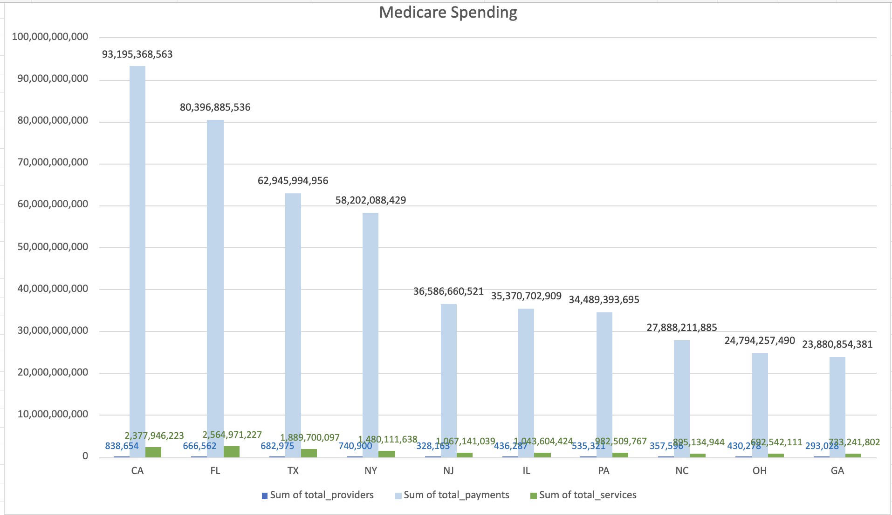

# Medicare Spending Analysis Across U.S. States (2014–2023)

# Project Overview

This project analyzes Medicare spending across U.S. states using CMS aggregated data (10-year total, not time-series).
The goal is to understand Medicare resources are distributed across states and which systems show higher pressure, inefficiency, or cost burden.

## This project is designed to answer business-relevant questions:

- Which states consume the highest share of Medicare spending?
- Is spending driven more by service volume or pricing levels?
- How does provider capacity affect system efficiency?
- Where is the healthcare system under the highest operational pressure?
- Which states show early indicators of future resource strain?

---

# Tools Used

- MySQL
- Microsoft Excel 

---

## Project Structure

```text
├── medicare
│   ├── analysis.md
│   ├── data
│   │   ├── comparison_raw_and_clean.csv
│   │   ├── state_summary_clean.csv
│   │   └── state_summary.csv
│   ├── README.md
│   ├── screenshots
│   └── sql
│       ├── 01_data_quality_checks.sql
│       └── 02_data_cleaning.sql.sql
└── README.md
```

---

# Data Source

CMS Medicare State Summary dataset  
Coverage: **2014–2023 (10 years)**

---

# Data Preparation & Validation

The original dataset included all U.S. states and territories.

Data cleaning and validation steps included:

- verified total row count
- checked missing values in key fields
- removed duplicate state entries
- standardized valid state codes only

---

# Project Findings & Solutions

* **California (CA)**, **Florida (FL)**, and **Texas (TX)** consume the highest shares of Medicare spending at **10.92%** (**93,195,368,563.161**), **9.42%** (**80,396,885,535.752**), and **7.37%** (**62,945,994,956.156**) respectively.  
  👉 Establish fiscal caps and audit high-expenditure local systems within CA to systematically lower its dominant drain on federal Medicare resources.

* **Spending drivers split by region:** Florida's budget is strictly volume-driven, whereas California and New York are driven by elevated pricing levels, with California spending **39.192** per service.  
  👉 Leverage Florida's low-unit-cost framework as a national benchmark to reconstruct pricing models in hyper-inflated states.

* **Low provider capacity severely compromises efficiency** by forcing extreme workloads on individual doctors, as seen in Florida where providers manage the nation's highest individual workload of **3,848.061** services.  
  👉 Deploy federal state-level grants and professional tax incentives to attract fresh medical workforce to FL, diluting individual caseload pressure.

* **Florida (FL)** operates under the absolute highest operational pressure across the entire healthcare system, managing a massive physical volume of **2,564,971,227.000** total services.  
  👉 Direct proactive capital investments toward FL’s clinical infrastructure to safeguard the system against localized operational collapse.

* **Early indicators of future resource strain** are visible in **Texas (TX)** due to its high average insurance markup ratio of **4.263**, and in **Florida (FL)** where peak workloads trigger high provider compensation at **120,614.265** per provider.  
  👉 Introduce legislative limits on commercial insurance markup margins in TX to insulate the public budget from market-driven cost inflation.

---

# Insurance Markup Ratios and Cost per Service Strain
  