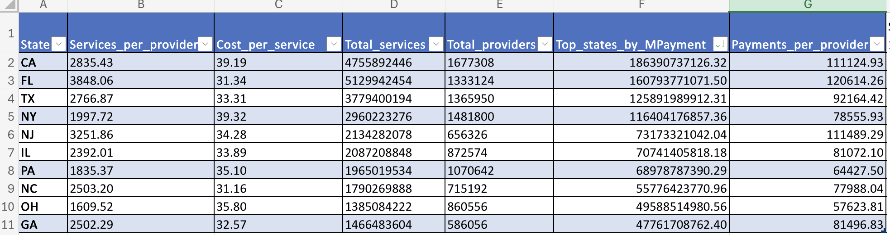
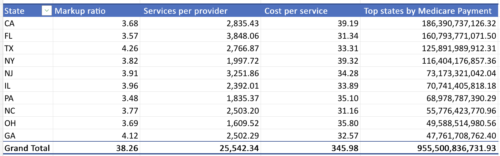
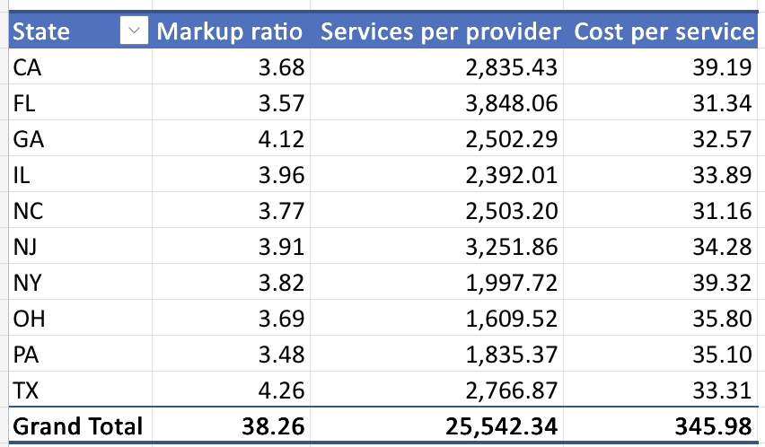

# Medicare Spending Analysis Across U.S. States (2014–2023)

## Project Structure

```text
medicare/
│
├── data/
│   └── state_summary.csv
│
├── excel/
│   ├── cleanedData.png
│   └── pivotTable.png
│
├── sql_queries_check_clean.sql
├── .gitignore
└── README.md
```

---

# Project Overview

This project analyzes Medicare spending across U.S. states using CMS aggregated data from 2014–2023.

The analysis focuses on understanding what drives differences in Medicare expenditures across states:

- utilization (service volume)
- pricing (cost per service)
- provider distribution

---

# Tools Used

- MySQL
- Microsoft Excel (data exploration and validation)

---

# Data Source

CMS Medicare State Summary dataset  
Coverage: **2014–2023 (10 years)**

---

# Data Preparation & Validation

The original dataset included all U.S. states and territories.

Data cleaning and validation steps included:

- verified total row count
- checked missing values in key fields
- removed duplicate state entries
- standardized valid state codes only

### Missing values check

Used to identify incomplete records in key fields:

```sql
SELECT *
FROM state_summary
WHERE state IS NULL
   OR total_payments IS NULL
   OR total_services IS NULL
   OR total_providers IS NULL;
   ```
### Duplicate state validation

Used to ensure each state appears only once or is properly aggregated:

```sql
SELECT state, COUNT(*)
FROM state_summary
GROUP BY state
HAVING COUNT(*) > 1;
```
### Data aggregation (state-level standardization)

Converted raw dataset into one row per state:

```sql
CREATE TABLE state_summary_clean AS
SELECT
    state,
    SUM(total_payments) AS total_payments,
    SUM(total_services) AS total_services,
    SUM(total_providers) AS total_providers,
    AVG(avg_markup_ratio) AS avg_markup_ratio
FROM state_summary
GROUP BY state;
```

---

# Cleaned and unified dataset in Excel


---

#  Pivot 1: Medicare Spending Drivers by State



##  Business Question
What drives differences in Medicare spending across states — **service utilization (volume)** or **pricing (cost per service)**?

---

##  Key Insights

- Medicare spending variation across states is mainly driven by **service utilization (volume)** rather than pricing metrics such as cost per service or markup ratio. High-spending states (CA, FL, TX, NY) consistently show higher service volumes rather than significantly higher price levels.
- Cost per service remains relatively stable across states (~31–39), suggesting limited variation in pricing.
- Markup ratio does not directly correlate with total Medicare spending. For example, Georgia shows a relatively high markup ratio despite lower total spending compared to Texas, indicating that pricing intensity is independent of system scale.

---

###  Recommendations

**1. Focus on utilization control**
- Target high-volume states (CA, FL, TX)
- Establish benchmarks for services per provider

**2. Define efficiency KPIs**
- Services per provider
- Provider productivity metrics
- Standardized utilization indicators across states

**3. Investigate structural pricing outliers**
States such as GA (high markup ratio but lower total spending) may reflect differences in service mix or localized pricing structures.

**4. Prioritize volume over price interventions**
Since pricing is relatively stable, cost containment strategies should focus on **reducing unnecessary utilization rather than adjusting prices**.

#  Pivot 2: Efficiency Ranking by State



##  Business Question
Which states show signs of **system overload** or **costly healthcare delivery structures**?

---

##  Key Insights

- States with the highest **services per provider** (FL, NJ, GA) also tend to have lower or mid-range **cost per service**.  
  This suggests that high workload is driven by **volume pressure, not higher pricing**.  
  Example: FL has the highest service load (3,848) but one of the lowest costs per service (31.34).

---

- States with the highest **cost per service** (NY, CA) do not have the highest utilization levels.  
  This indicates a **cost-driven efficiency issue**, not workload pressure.  
  Example: NY has high cost per service (~39) but lower service intensity (~1,997 per provider).

---

- **Markup ratio variations** (e.g., TX, GA) do not align consistently with either volume or cost patterns.  
  This suggests pricing structure differences exist independently from utilization levels.

---

### 💡 Recommendations

**1. Address workload pressure where volume is high**
- FL, NJ → expand provider capacity to reduce overload

**2. Investigate high-cost systems**
- NY, CA → review pricing and reimbursement structures

**3. Do not assume correlation between cost and volume**
- High utilization ≠ high cost per service
- States behave differently across these dimensions

**4. Use dual-axis policy view**
- One axis = workload (services per provider)
- Second axis = pricing efficiency (cost per service)