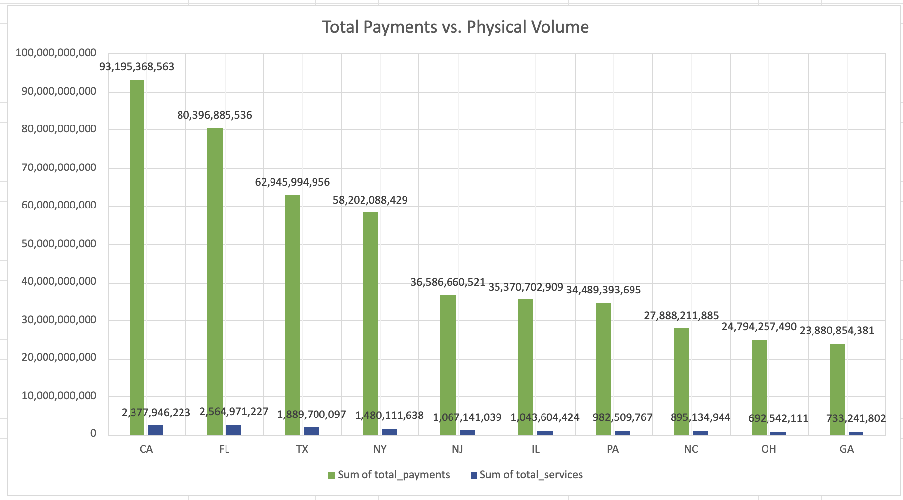
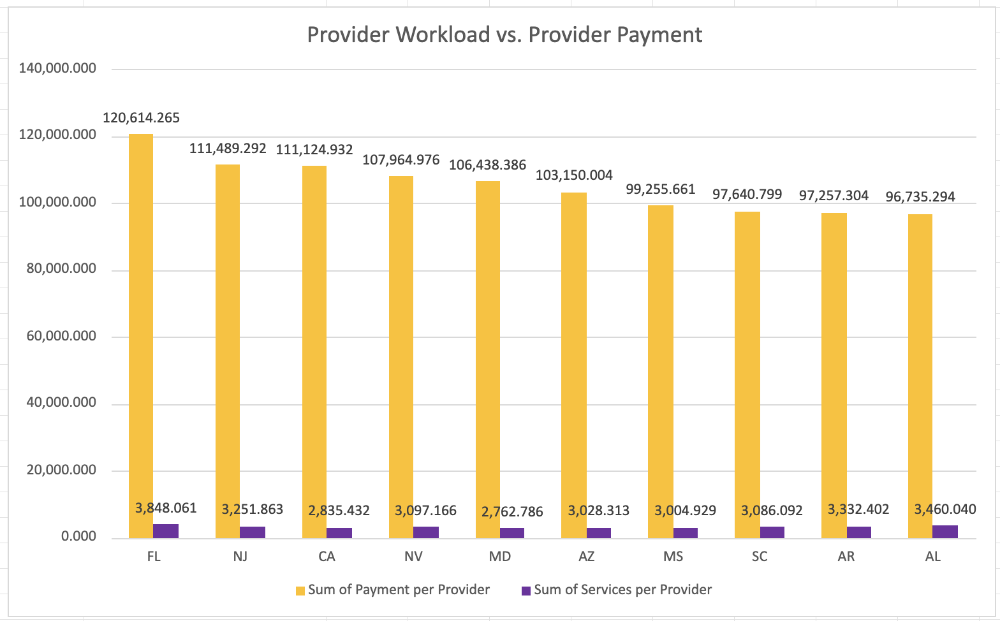
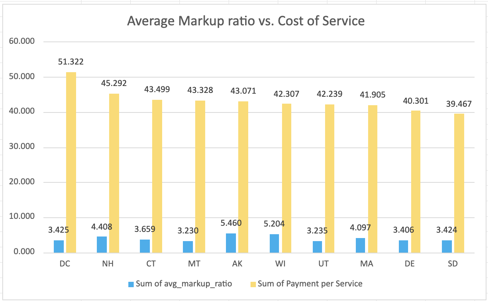

# Medicare Spending Analysis: National Data & Findings

# Medicare Spending: State Breakdown

| State | Total Payments | Total Services | Total Providers | Avg Markup Ratio | Payment per Service | Services per Provider | Payment per Provider | % of Total US Payments |
| :--- | :--- | :--- | :--- | :--- | :--- | :--- | :--- | :--- |
| CA | 93,195,368,563.16 | 2,377,946,223.00 | 838,654.00 | 3.678 | 39.192 | 2,835.432 | 111,124.932 | 10.92% |
| FL | 80,396,885,535.75 | 2,564,971,227.00 | 666,562.00 | 3.574 | 31.344 | 3,848.061 | 120,614.265 | 9.42% |
| TX | 62,945,994,956.16 | 1,889,700,097.00 | 682,975.00 | 4.263 | 33.310 | 2,766.866 | 92,164.420 | 7.37% |
| NY | 58,202,088,428.68 | 1,480,111,638.00 | 740,900.00 | 3.817 | 39.323 | 1,997.721 | 78,555.930 | 6.82% |
| NJ | 36,586,660,521.02 | 1,067,141,039.00 | 328,163.00 | 3.908 | 34.285 | 3,251.863 | 111,489.292 | 4.29% |
| IL | 35,370,702,909.09 | 1,043,604,424.00 | 436,287.00 | 3.964 | 33.893 | 2,392.014 | 81,072.099 | 4.14% |
| PA | 34,489,393,695.14 | 982,509,767.00 | 535,321.00 | 3.477 | 35.103 | 1,835.366 | 64,427.500 | 4.04% |
| NC | 27,888,211,885.48 | 895,134,944.00 | 357,596.00 | 3.766 | 31.155 | 2,503.202 | 77,988.042 | 3.27% |
| OH | 24,794,257,490.28 | 692,542,111.00 | 430,278.00 | 3.693 | 35.802 | 1,609.522 | 57,623.809 | 2.90% |
| GA | 23,880,854,381.20 | 733,241,802.00 | 293,028.00 | 4.119 | 32.569 | 2,502.293 | 81,496.834 | 2.80% |
| MD | 23,750,022,761.67 | 616,471,585.00 | 223,134.00 | 3.318 | 38.526 | 2,762.786 | 106,438.386 | 2.78% |
| MI | 23,636,095,677.85 | 612,240,150.00 | 377,865.00 | 3.266 | 38.606 | 1,620.262 | 62,551.694 | 2.77% |
| VA | 23,201,746,597.22 | 692,182,348.00 | 264,222.00 | 3.482 | 33.520 | 2,619.700 | 87,811.562 | 2.72% |
| MA | 21,776,753,246.45 | 519,671,352.00 | 331,016.00 | 4.097 | 41.905 | 1,569.928 | 65,787.615 | 2.55% |
| AZ | 21,757,533,552.82 | 638,765,185.00 | 210,931.00 | 3.539 | 34.062 | 3,028.313 | 103,150.004 | 2.55% |
| TN | 20,356,600,937.46 | 687,690,909.00 | 246,572.00 | 3.902 | 29.601 | 2,789.006 | 82,558.445 | 2.38% |
| SC | 15,783,732,855.33 | 498,869,912.00 | 161,651.00 | 3.702 | 31.639 | 3,086.092 | 97,640.799 | 1.85% |
| IN | 15,685,227,965.26 | 436,245,677.00 | 220,843.00 | 3.863 | 35.955 | 1,975.366 | 71,024.338 | 1.84% |
| AL | 14,483,982,029.87 | 518,064,823.00 | 149,728.00 | 3.711 | 27.958 | 3,460.040 | 96,735.294 | 1.70% |
| MO | 14,481,161,171.80 | 439,825,976.00 | 213,166.00 | 3.939 | 32.925 | 2,063.303 | 67,933.729 | 1.70% |
| WA | 14,312,061,541.08 | 380,646,546.00 | 243,216.00 | 3.525 | 37.599 | 1,565.056 | 58,845.066 | 1.68% |
| LA | 11,220,246,921.61 | 301,644,968.00 | 147,444.00 | 4.031 | 37.197 | 2,045.827 | 76,098.362 | 1.31% |
| WI | 10,965,873,157.04 | 259,196,980.00 | 225,896.00 | 5.204 | 42.307 | 1,147.417 | 48,543.901 | 1.28% |
| CO | 10,852,606,546.57 | 313,195,514.00 | 175,259.00 | 3.838 | 34.651 | 1,787.044 | 61,923.248 | 1.27% |
| KY | 10,744,846,403.92 | 308,702,209.00 | 160,099.00 | 3.526 | 34.807 | 1,928.196 | 67,113.763 | 1.26% |
| OK | 10,278,754,379.34 | 301,325,909.00 | 117,897.00 | 3.634 | 34.112 | 2,555.840 | 87,184.189 | 1.20% |
| CT | 9,663,738,701.31 | 222,160,861.00 | 155,536.00 | 3.659 | 43.499 | 1,428.357 | 62,131.845 | 1.13% |
| AR | 8,819,292,301.97 | 302,182,245.00 | 90,680.00 | 3.524 | 29.185 | 3,332.402 | 97,257.304 | 1.03% |
| KS | 8,640,750,983.00 | 296,359,666.00 | 106,998.00 | 3.758 | 29.156 | 2,769.768 | 80,756.192 | 1.01% |
| MS | 8,623,133,278.61 | 261,062,242.00 | 86,878.00 | 4.029 | 33.031 | 3,004.929 | 99,255.661 | 1.01% |
| MN | 8,227,677,248.34 | 252,202,291.00 | 234,310.00 | 4.075 | 32.623 | 1,076.362 | 35,114.495 | 0.96% |
| NV | 8,024,604,790.09 | 230,199,970.00 | 74,326.00 | 4.273 | 34.859 | 3,097.166 | 107,964.976 | 0.94% |
| IA | 7,074,985,374.69 | 205,683,016.00 | 112,888.00 | 3.569 | 34.398 | 1,822.010 | 62,672.608 | 0.83% |
| OR | 6,709,842,808.32 | 192,439,875.00 | 129,743.00 | 3.951 | 34.867 | 1,483.239 | 51,716.415 | 0.79% |
| NE | 5,275,288,091.93 | 174,936,410.00 | 75,928.00 | 3.508 | 30.155 | 2,303.978 | 69,477.506 | 0.62% |
| UT | 4,997,756,833.36 | 118,321,207.00 | 78,771.00 | 3.235 | 42.239 | 1,502.091 | 63,446.660 | 0.59% |
| WV | 4,114,571,353.07 | 118,080,451.00 | 66,614.00 | 3.611 | 34.845 | 1,772.607 | 61,767.367 | 0.48% |
| DE | 3,844,939,064.45 | 95,404,864.00 | 40,007.00 | 3.406 | 40.301 | 2,384.704 | 96,106.658 | 0.45% |
| NM | 3,419,190,190.40 | 93,545,939.00 | 59,725.00 | 3.743 | 36.551 | 1,566.278 | 57,248.894 | 0.40% |
| NH | 3,231,381,625.39 | 71,345,801.00 | 63,233.00 | 4.408 | 45.292 | 1,128.300 | 51,102.773 | 0.38% |
| ID | 3,123,621,427.37 | 81,368,651.00 | 53,929.00 | 2.888 | 38.389 | 1,508.811 | 57,920.997 | 0.37% |
| ME | 2,773,534,002.35 | 77,788,333.00 | 63,066.00 | 3.177 | 35.655 | 1,233.443 | 43,978.277 | 0.32% |
| RI | 2,497,182,455.95 | 66,254,145.00 | 45,730.00 | 3.563 | 37.691 | 1,448.811 | 54,607.095 | 0.29% |
| MT | 2,103,538,638.40 | 48,549,562.00 | 41,606.00 | 3.230 | 43.328 | 1,166.888 | 50,558.541 | 0.25% |
| SD | 2,021,520,124.71 | 51,220,450.00 | 38,942.00 | 3.424 | 39.467 | 1,315.301 | 51,911.050 | 0.24% |
| DC | 2,013,590,128.12 | 39,234,601.00 | 33,697.00 | 3.425 | 51.322 | 1,164.335 | 59,755.768 | 0.24% |
| HI | 1,970,528,989.64 | 52,420,454.00 | 35,676.00 | 3.425 | 37.591 | 1,469.348 | 55,234.023 | 0.23% |
| ND | 1,667,841,674.67 | 45,465,449.00 | 35,119.00 | 3.736 | 36.684 | 1,294.611 | 47,491.149 | 0.20% |
| AK | 1,445,044,405.96 | 33,549,938.00 | 25,432.00 | 5.460 | 43.071 | 1,319.202 | 56,819.928 | 0.17% |
| VT | 1,173,084,100.77 | 33,979,774.00 | 28,006.00 | 3.354 | 34.523 | 1,213.303 | 41,886.885 | 0.14% |
| WY | 1,133,885,036.87 | 37,652,626.00 | 19,794.00 | 4.386 | 30.114 | 1,902.224 | 57,284.280 | 0.13% |

---

## Correlation Findings

### Impact of Volume on Spending (0.99)
The 0.99 correlation proves that service volume is the absolute, dominant driver of Medicare spending nationwide. Total spending is almost perfectly tied to how many services are performed, not what they cost.

### Impact of Pricing on Spending (-0.15)
The negative correlation (-0.15) means that states with higher baseline prices (Payment per Service) do not automatically consume more total Medicare dollars. In fact, some lower-cost states spend more overall due to sheer volume.

### Impact of Markups on Spending (0.03)
The near-zero correlation (0.03) proves that hospital markup ratios (avg_markup_ratio) have completely no statistical relationship with how much Medicare ultimately spends in a state.

---

### National Overview Metrics

| Metric | Value |
| :--- | :--- |
| **Total Payments (All States & DC)** | $853,628,187,740.99 |
| **Total Services in US** | 24,453,052,136.00 |
| **Total Number of Providers** | 10,575,337.00 |

### Key Efficiency & Performance Indicators

| Indicator | Average Value |
| :--- | :--- |
| **Average Payment per Service** | $36.08 |
| **Average Services per Provider** | 2,063.82 |
| **Average Payment per Provider** | $72,379.70 |

---

# Analysis of Spending Drivers and Operational Pressure

* **California (CA)** consumes the absolute **highest share of Medicare spending** at **10.92%** (**93,195,368,563.161**), despite delivering a lower volume of services (**2,377,946,223.000**) than Florida (FL). This proves its spending is heavily driven by elevated **pricing levels** (**39.192** per service).
* **Florida (FL)** consumes the second-highest share of Medicare spending at **9.42%** (**80,396,885,535.752**) but leads the nation in physical service volume, delivering **2,564,971,227.000** total services. This establishes Florida as the region under the **highest operational pressure**, where spending is driven strictly by massive **service volume**.
* **Texas (TX)** consumes the third-highest share of Medicare spending at **7.37%** (**62,945,994,956.156**), demonstrating a more balanced baseline where an expansive volume of **1,889,700,097.000** services is paired with a moderate pricing level of **33.310** per service.

### 💡 Recommendations
* **Implement Price Controls in CA:** Target structural costs and reimbursement rates in California to curb pricing-driven budget expansion, as it represents the largest single-state drain on national funds.
* **Audit Florida's Model for Scalability:** Benchmark Florida's healthcare infrastructure to understand how it sustains peak national service volume at lower relative unit costs.

---

# Provider Workload and Healthcare System Pressure
 

* **Florida (FL)** demonstrates how **provider capacity severely affects system efficiency** by consolidating the highest provider workload at **3,848.061** services per provider, which simultaneously forces the highest payment per provider at **120,614.265**.
* **California (CA)** reveals a stark contrast in system efficiency, where a larger provider network (**838,654.000** providers) yields a substantially lower individual workload of **2,835.432** services per provider, yet maintains a high payment per provider of **111,124.932** due to its higher cost-per-service structure.
* **Texas (TX)** shows an alternative efficiency breakdown with a lower payment per provider of **92,164.420** across its network of **682,975.000** providers, managing a workload of **2,766.866** services per individual.

### 💡 Recommendations
* **Expand Provider Networks in FL:** Incentivize new healthcare providers to relocate to Florida to increase provider capacity, mitigate severe individual workload strains, and lower the risk of systemic burnout.
* **Review Provider Utilization in CA:** Investigate California's lower provider utilization rate to ensure high provider compensation aligns with actual healthcare access metrics.

---

# Insurance Markup Ratios and Cost per Service Strain
 

* **Texas (TX)** highlights a key **early indicator of future resource strain**, exhibiting the highest commercial average markup ratio at **4.263** among the top three states. This aggressive market markup risks driving up future program costs even while its current real payment per service remains moderate at **33.310**.
* **California (CA)** combines a substantial commercial markup ratio of **3.678** with a high baseline real cost of **39.192** per service, showing that its top-tier budget consumption is driven by a mix of market markups and underlying pricing levels.
* **Florida (FL)** maintains the lowest commercial markup ratio of the group at **3.574**, further reinforcing that its financial pressure is volume-driven rather than commercially inflated.

### 💡 Recommendations
* **Monitor Commercial Markups in TX:** Introduce policy tracking or transparency rules on commercial health insurance markups in Texas to prevent aggressive market pricing from inflating future real costs of service.
* **Subsidize Baseline Efficiency:** Support volume-heavy frameworks like Florida's to ensure commercial markups do not compromise the state's capacity to process peak national service volume.
